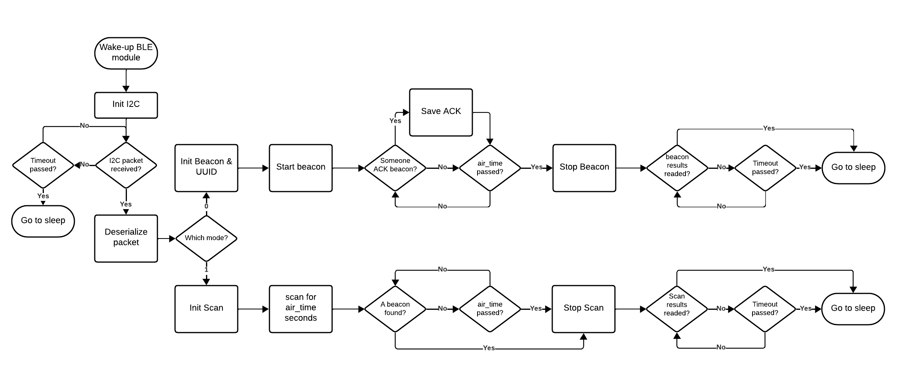
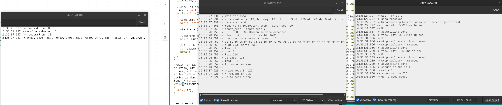
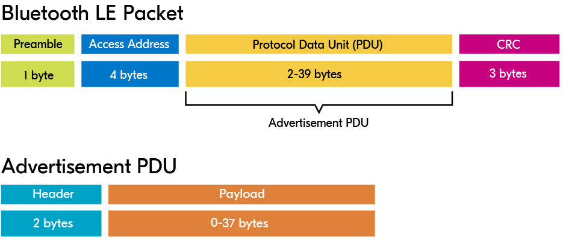
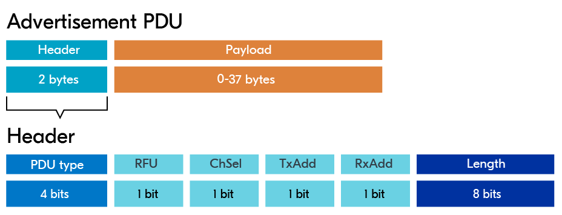

## BLE and STM32 I2C communication


To enable the BLE inter-communication, we use I2C as device connection to the STM32L4. 
Here, the BLE module shall have the address $0x12$ and the following struct will be send over.
```
struct ble_module_data_t
{
uint8_t mode; // The mode of the BLE-module, 0 -> beacon, 1-> scan
uint8_t ssr_id; // The ID of the rover itself
uint8_t air_time; // How long the beacon may last (val*100=ms)
int16_t env_temperature; // Range from -327.68 to 327.67 °C (val/100=°C)
uint8_t env_humidity; // Range from -0-100%
uint16_t env_lux; // Range from 0 to 1000
uint16_t dev_voltage; // Range from 0-6.5535V (val/10000=V) (val/10=mV)
int8_t gyro_x; // Range from -60 to 60 (val*3=°)
int8_t gyro_y; // Range from -60 to 60 (val*3=°)
int8_t gyro_z; // Range from -60 to 60 (val*3=°)
};
```
A total of 11 bytes (without gyro or other parameters).

The STM32L4 will wake-up at a certain point and will check if the BLE-Beacon must be activated or not. If so, the BLE-module will be waken up on GPIO2 with a High flank trigger. This will bring the BLE-module out of deep sleep.

Then, STM32L4 will wait when the device is available on the I2C bus. After the BLE-module has set itself as available, the STM32L4 sends the *ble_module_data_t* struct with certain values over I2C to BLE-module.

Based on the *mode* it will either perform a beacon or a scanning operation for *air_time* amount of seconds.

After the performed *mode*, the BLE-module will wait for the STM32L4 to reach out to get the result of the performed mode.
The result can be a *ble_beacon_result_t* or a *ble_scan_result_t* depending on the selected mode at the beginning of the computation.

*ble_beacon_result_t*  is selected when we had mode 0 or beacon mode.
```
struct ble_beacon_result_t
{
uint8_t amount_of_ack;
};
```
This result will yield the amount of acknowledgements from scanners in the area.

The *ble_scan_result_t* gives a more detailed result of the found beacon in the area.
```
struct ble_scan_result_t
{
uint8_t ssr_id; // The ID of the source
int16_t temperature; // Range from -327.68 to 327.67 °C (val/100=°C)
uint8_t humidity; // Range from -0-100%
uint16_t lux; // Range from 0 to 1000
uint16_t voltage; // Range from 0-6.5535V (val/10000=V) (val/10=mV)
int8_t rssi; //rssi
int8_t gyro_x; // Range from -60 to 60 (val*3=°)
int8_t gyro_y; // Range from -60 to 60 (val*3=°)
int8_t gyro_z; // Range from -60 to 60 (val*3=°)
};
```
For now, only 1 beacon gets saved and returned to the STM32L4 on request.

To know on the STM32L4 side that the received data is valid, their is a small "check" build in that will be the difference of $255$ with the first written byte. This value is added to the return value.

> For example, given this first byte: $15$ for the return struct of *ble_beacon_result_t*. 
> There is only 1 byte present in this struct, so we add another byte which has value $15-255=230$
> Total bytes transmitted: $[15,230]$

In order to not let the BLE-Module wait infinite on the request of the STM32L4, there is a timeout implemented that after 2 seconds, will trigger after the BLE-module has completed its task. This to prevent power consumption if the SMT32L4 missed something or that something went wrong. When the receive window ends, the data will be lost.


**ttyUSB0** (left) represents the emulated STM32 which triggers the BLE-module in mode 1 and waits for its response.
**ttyACM2** (middle) represents the BLE-module in scanning mode (mode 1) and will scan the medium until a beacon is discovered as shown.
**ttyACM3** (right) represents the beacon BLE-module and is connected to the STM32L4.

As can be observed, a beacon gets fireded where the scanner detect the beacon. The scanner saves the UUID values of the beacon which has $SSR_{id}=0x81$. This ID can be spotted at the received data on the emulated STM32L4. The same holds for the temperature $0x71 = 113$, humidity $0x00 = 0$, lux $0x72=114$, voltage $0x73 = 115$, and rssi $0xd4 = -44$.

## Modes
### Mode 0
Mode 0 or beacon mode will transmit a beacon. This beacon will be in air for *air_time* and will have a customised UUID of 16-bytes which is structured the following:
```
[0] ->  Temperature MSB(yte)
[1] ->  Temperature LSB(yte)
[2] ->  Humidity
[3] ->  Lux MSB(yte)
[4] ->  Lux LSB(yte)
[5] ->  Device Supercap Voltage MSB(yte)
[6] ->  Device Supercap Voltage LSB(yte)
[7] ->  gyro-x
[8] ->  gyro-y
[9] ->  gyro-z
[10] -> /0xFF
[11] -> /0xFF
[12] -> /0xFF
[13] -> /0xFF
[14] -> /0xFF
[15] -> /0xFF
```
The minor and major will have a certain purpose as well.
**Major**
- The major will consist of the upper byte as an ID of the BLE-device itself. This must be different for each BLE-device. Furthermore, a range of $[0-255]$ addresses can be used. 
  A total of *256* devices can exist at the same time for the same purpose.
- The lower byte of the major is the ID of the SSR-rover itself. This ID is defined in *ble_module_data_t* as *ssr_id*.
**Minor**
- The minor is not touched at the moment and is set to $0x0000$.
```
beacon.setMajorMinor((BEACON_SSR_ID << 8 |i2c_data.ssr_id), 0x0000);
```

When a scanner ACKs a beacon, the beacon gets halted for a moment. The beacon will count the amount of ACKs received. The amount of received ACKs will determine the amount of devices in present surrounding.

After the *air_time* has finished, the beacon will stop. The BLE module now waits for the STM32 to reached back. After the STM32 reached back or if the window has passed, the BLE goes to sleep again.

### Mode 1
Mode 1 is when we use the BLE module as scanner to search for BLE beacons in the proximity area. This allows for intercommunication between the SSRs. Same as Beacon, the scan will be in air for *air_time* and will have a named that represents the BLE-devide ID and the *ssr_id*.

All this data is encapsulated in the advertisement data packet. This consists of the following:
- Preamable (1-byte)
- Access Address (4-bytes)
- Protocol Data Unit (2-39-bytes)
- CRC (3-bytes)



Our wanted data will be situated in the Protocol Data Unit or PDU packet. Here we have the following structure:
- Header (2-bytes)
- Payload (0-37-bytes)



And the header can be subdivided into:
- PDU types (4-bits)
- RFU (1-bit)
- ChSel (1-bit)
- TxAdd (1-bit)
- RxAdd (1-bit)
- Length (8-bit)

[reference for images of packet structures](https://academy.nordicsemi.com/courses/bluetooth-low-energy-fundamentals/lessons/lesson-2-bluetooth-le-advertising/topic/advertisement-packet/)

One note here, this is not a normal advertisement packet. This is an iBeacon packet which has a slightly different packet structure as described below.


An example where we distinguish all elements in the full Bluetooth BLE packet
```
02-01-06-1A-FF-59-00-02-15-00-5C-00-00-5D-00-5E-FF-FF-FF-FF-FF-FF-FF-FF-FF-3F-6C-00-00-CA

```

**1. Flags Field** (`02-01-06`):

- **Length (02)**: 2 bytes.
- **Type (01)**: Flags.
- **Value (06)**:
    - **LE General Discoverable Mode** (bit 1 set).
    - **BR/EDR Not Supported** (bit 2 set).

**2. Manufacturer Specific Data** (`1A-FF-59-00-02-15-00-5C-00-00-5D-00-5E-FF-FF-FF-FF-FF-FF-FF-FF-FF-3F-6C-00-00-CA`):

- **Length (1A)**: 26 bytes.
- **Type (FF)**: Manufacturer Specific Data.
- **Company Identifier (59-00)**:
    - Assigned by Bluetooth SIG, corresponds to **Nordic Semiconductor ASA**.

**iBeacon-Specific Fields:**

- **Beacon Type (`02-15`)**:
    - `02`: iBeacon Indicator.
    - `15`: Indicates the iBeacon payload size (21 bytes).
- **UUID (`00-5C-00-00-5D-00-5E-FF-FF-FF-FF-FF-FF-FF-FF-FF`)**:
    - A unique identifier for this beacon.
    - This UUID encodes environmental telemetry, replacing a static UUID typical in iBeacon usage.
- **Major Value (`3F-6C`)**:
    - `3F` the id of a SSR beacon.
    - `6C` the SSR ID.
- **Minor Value (`00-00`)**:
    - not set in our project
- **Measured Power (`CA`)**:
    - The signal strength (RSSI) at 1 meter, used for distance estimation.
    - Decoded as `-54 dBm` (signed integer).

[Source](https://semiwiki.com/semiconductor-services/einfochips/302892-understanding-ble-beacons-and-their-applications/)

For now, we only save 1 beacon in our memory and we do not continue with scanning the medium. Nevertheless, the code is adapted to save multiple founded beacons within a specified *ari-time*.

After the *air_time* has finished or their was a beacon found, the scanner will stop. The BLE module now waits for the STM32 to reached back. After the STM32 reached back or if the window has passed, the BLE goes to sleep again.