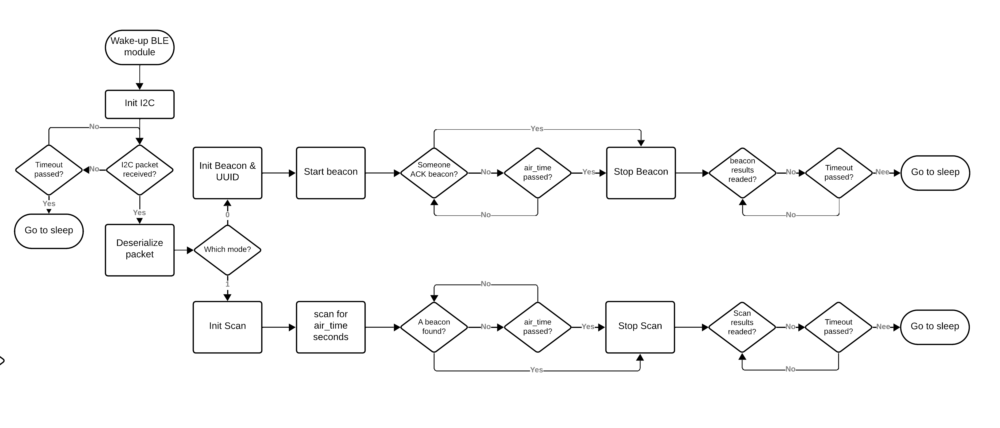

## BLE and STM32 I2C communication

To enable the BLE inter-communication, we use I2C as device connection to the STM32L4. 
Here, the BLE module shall have the address $0x12$ and the following struct will be send over.
```
struct ble_module_data_t
{
uint8_t mode; // The mode of the BLE-module, 0 -> beacon, 1-> scan
uint8_t ssr_id; // The ID of the rover itself
uint8_t air_time; // How long the beacon may last (val*100=ms)
int16_t env_temperature; // Range from -327.68 to 327.67 °C (val/100=°C)
uint8_t env_humidity; // Range from -0-100%
uint16_t env_lux; // Range from 0 to 1000
uint16_t dev_voltage; // Range from 0-6.5535V (val/10000=V) (val/10=mV)
// x gyro 8bit?
// y gyro 8bit?
// z gyro 8bit?
};
```
A total of 11 bytes (without gyro or other parameters).

The STM32L4 will wake-up at a certain point and will check if the BLE-Beacon must be activated or not. If so, the BLE-module will be waken up on GPIO2 with a High flank trigger. This will bring the BLE-module out of deep sleep.

Then, STM32L4 will wait when the device is available on the I2C bus. After the BLE-module has set itself as available, the STM32L4 sends the *ble_module_data_t* struct with certain values over I2C to BLE-module.

Based on the *mode* it will either perform a beacon or a scanning operation for *air_time* amount of seconds.
## Modes
### Mode 0
Mode 0 or beacon mode will transmit a beacon. This beacon will be in air for *air_time* and will have a customised UUID of 16-bytes which is structured the following:
```
[0] ->  Temperature MSB(yte)
[1] ->  Temperature LSB(yte)
[2] ->  Humidity
[3] ->  Lux MSB(yte)
[4] ->  Lux LSB(yte)
[5] ->  Device Supercap Voltage MSB(yte)
[6] ->  Device Supercap Voltage LSB(yte)
[7] ->  /0xFF
[8] ->  /0xFF
[9] ->  /0xFF
[10] -> /0xFF
[11] -> /0xFF
[12] -> /0xFF
[13] -> /0xFF
[14] -> /0xFF
[15] -> /0xFF
```
The minor and major will have a certain purpose as well.
**Major**
- The major will consist of the upper byte as an ID of the BLE-device itself. This must be different for each BLE-device. Furthermore, a range of $[0-255]$ addresses can be used. 
  A total of *256* devices can exist at the same time for the same purpose.
- The lower byte of the major is the ID of the SSR-rover itself. This ID is defined in *ble_module_data_t* as *ssr_id*.
**Minor**
- The minor is not touched at the moment and is set to $0x00000$.

When a scanner ACKs a beacon, the beacon gets halted for a moment. The beacon will count the amount of ACKs received. The amount of received ACKs will determine the amount of devices in present surrounding.

After the *air_time* has finished, the beacon will stop. The BLE module now waits for the STM32 to reached back. After the STM32 reached back, the BLE goes to sleep again.

### Mode 1
Mode 1 is when we use the BLE module as scanner to search for BLE beacons in the proximity area. This allows for intercommunication between the SSRs. Same as Beacon, the scan will be in air for *air_time* and will have a named that represents the BLE-devide ID and the *ssr_id*

