## Code flow diagram
Our brain, STM32L412KB, will have a certain flow as depicted in the block schematic below.


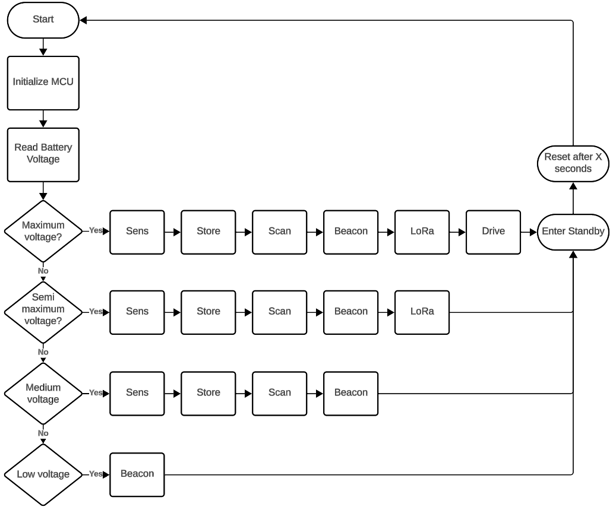

Each task is again represented with a code flow diagram
### Sens
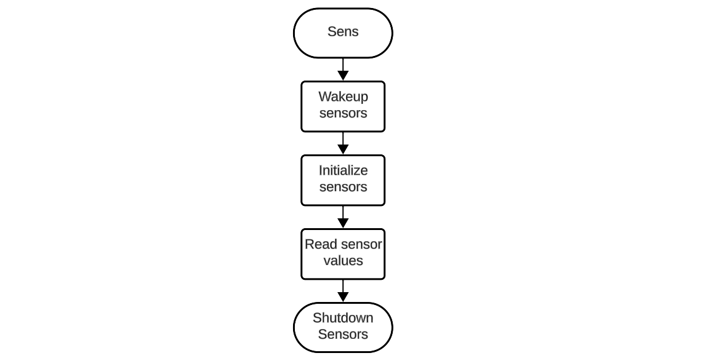
### Store
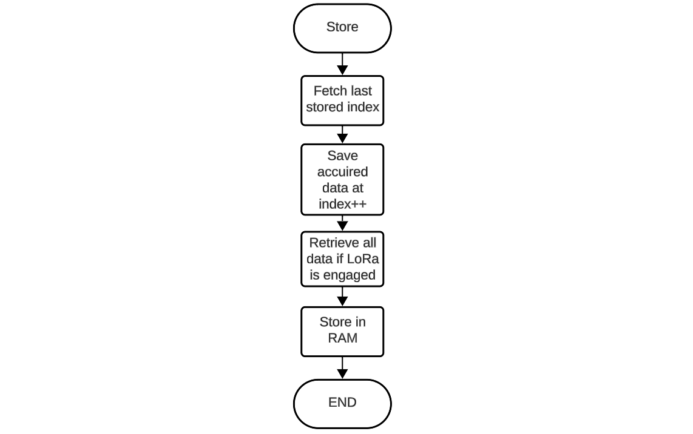
### Scan
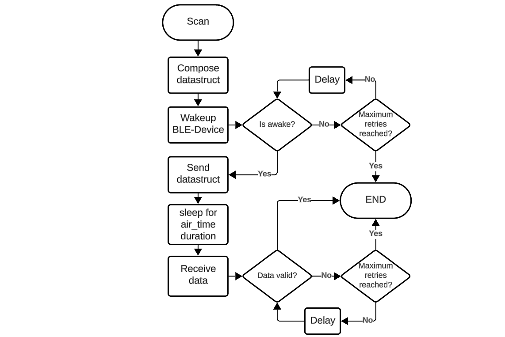
### Beacon
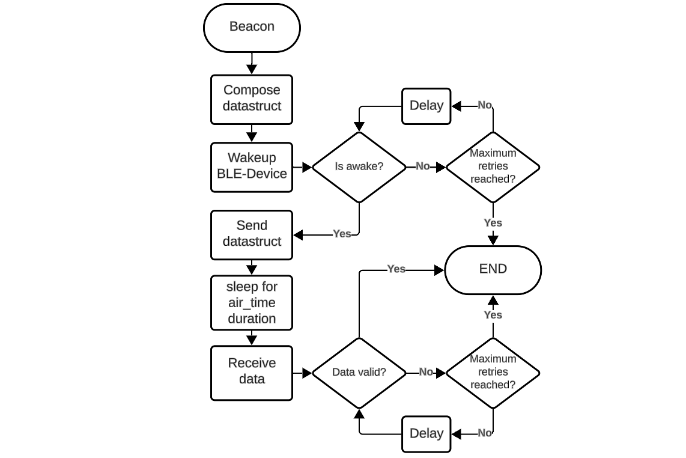
### LoRa
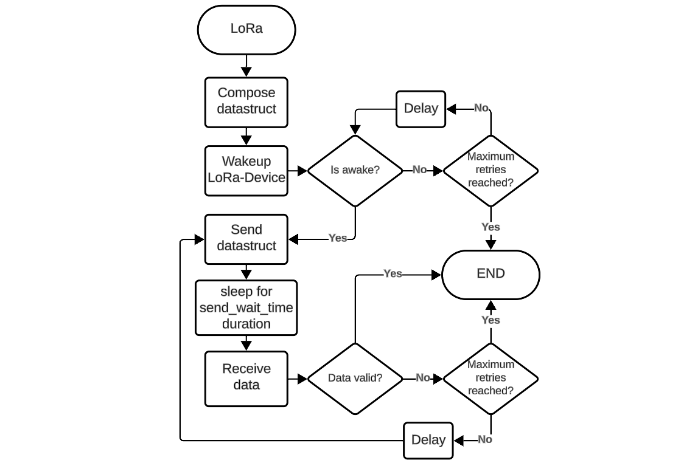
### Drive
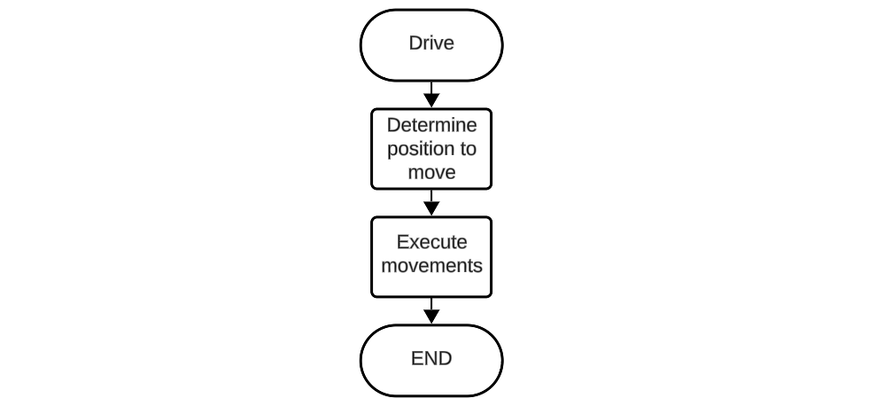


This is coded in a finite state machine which cycles through the different states. This to provide a minimal code footprint onto the MCU.

## Data formats

The format used to transmit over LoRa.
```c
struct ble_module_data_t
{
	uint8_t ssr_id; // The ID of the rover itself
	int32_t counter; //The packet counter of the measurements.
	int16_t env_temperature; // Range from -327.68 to 327.67 °C (val/100=°C)
	uint8_t env_humidity; // Range from -0-100%
	uint16_t env_lux; // Range from 0 to 1000
	uint16_t dev_voltage; // Range from 0-6.5535V (val/10000=V) (val/10=mV)
	int8_t dev_gyro_x; // Range from -60 to 60 (val*3=°)
	int8_t dev_gyro_y; // Range from -60 to 60 (val*3=°)
	int8_t dev_gyro_z; // Range from -60 to 60 (val*3=°)
};
```

The data structure to save SSR data locally.
```c
struct ssr_data
{
	uint16_t seq_number; // Range from 0 to 511 (8 bits total usage)
	int16_t env_temperature; // Range from -327.68 to 327.67 °C (val/100=°C)
	uint8_t env_humidity; // Range from -0-100%
	uint16_t env_lux; // Range from 0 to 1000
	uint16_t dev_voltage; // Range from 0-6.5535V (val/10000=V) (val/10=mV)
	int8_t dev_gyro_x; // Range from -125 to 125 (val*2=°)
	int8_t dev_gyro_y; // Range from -125 to 125 (val*2=°)
	int8_t dev_gyro_z; // Range from -125 to 125 (val*2=°)
};
typedef struct ssr_data ssr_data_t;
```

The data structure used to communicate with the BLE device the first time (at startup of the BLE-device).
```c
struct ble_module_data
{
	uint8_t mode; // The mode of the BLE-module, 0 -> beacon, 1-> scan
	uint8_t ssr_id; // The ID of the rover itself
	uint8_t air_time; // How long the beacon may last (val*100=ms)
	int16_t env_temperature; // Range from -327.68 to 327.67 °C (val/100=°C)
	uint8_t env_humidity; // Range from -0-100%
	uint16_t env_lux; // Range from 0 to 1000
	uint16_t dev_voltage; // Range from 0-6.5535V (val/10000=V) (val/10=mV)
	int8_t dev_gyro_x; // Range from -60 to 60 (val*3=°)
	int8_t dev_gyro_y; // Range from -60 to 60 (val*3=°)
	int8_t dev_gyro_z; // Range from -60 to 60 (val*3=°)
};
typedef struct ble_module_data ble_module_data_t;
```

The data structure used to communicate with the BLE after a scan request.
```c
struct ble_scan_result
{
	uint8_t ssr_id; // The ID of the source
	int16_t env_temperature;// temperature
	uint8_t env_humidity; // humidity
	uint16_t env_lux; // lux (light)
	uint16_t dev_voltage; // voltage
	int8_t rssi; //rssi
	int8_t dev_gyro_x; // Range from -60 to 60 (val*3=°)
	int8_t dev_gyro_y; // Range from -60 to 60 (val*3=°)
	int8_t dev_gyro_z; // Range from -60 to 60 (val*3=°)
};
typedef struct ble_scan_result ble_scan_result_t ;
```

The data structure used to communicate with the BLE after a beacon request.
```c
struct ble_beacon_result
{
	// How many devices have acked the Beacon. this determines the amount of nodes present
	uint8_t amount_of_ack;
};
typedef struct ble_beacon_result ble_beacon_result_t;
```


#todo 

### BLE communication with STM32 mocking counterpart
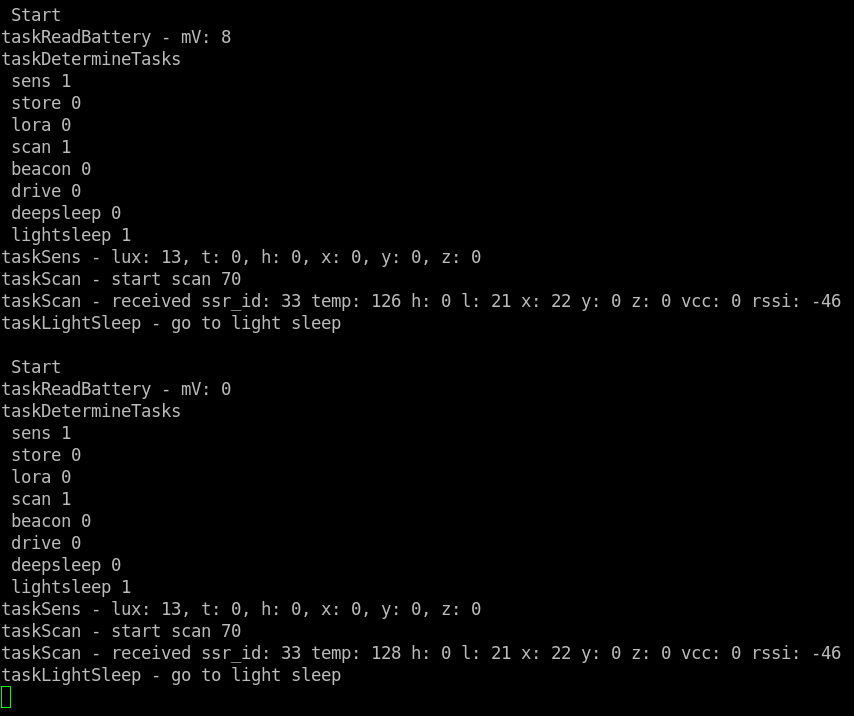

The image displays a terminal or command-line interface showing the output of an execution path. The output is divided into two sections, each beginning with "Start" and followed by a series of tasks and their statuses. Here's a summary of what each section includes:

1. **Battery Voltage Reading**: The first task shows the battery voltage reading, measured in millivolts (mV).
    
2. **Task Determination**: Indicates the status of various tasks such as sensing, storage, LoRa communication, scanning, beacon, driving, deep sleep, and light sleep.
    
3. **Sensor Readings**: Displays values for different sensors including lux (light), temperature (t), humidity (h), and coordinates (x, y, z).
    
4. **Scan Task**: Shows the start of a scan and receipt of data with specific values for sensor ID, temperature, humidity, coordinates, voltage, and RSSI (Received Signal Strength Indicator).
    
5. **Light Sleep Mode**: Indicates the system entering light sleep mode.

Here, only sens, scan and sleep is used. The BLE-module returns its founded results of a scanner nearby.
#### Real values example from 2 STM32 modules
In this example, we took 1 full system and let it run through the sens, scan, beacon and light_sleep tasks. 
The other module will only consist of a STM32L4 and the BLE-module (due to lack of sensors). This system will go through the tasks scanning and light_sleep.
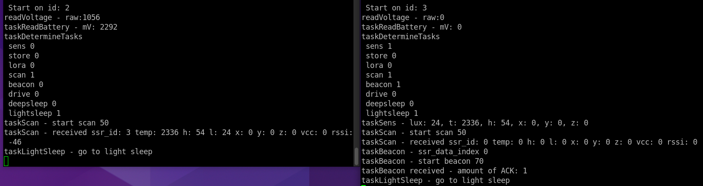

The left represents the output of the scanning controller where the received values can be matched to the right terminal output which is from the full system controller.
`taskScan - received ssr_id: 3 temp: 2336 h: 54 l: 24 x: 0 y:0 z:0 vcc: 0 rssi: -46`

- **ssr_id** matches the id 3
- **temp**(erature) matches the sensed environment temperature 2336 or 23.36°C
- **h**(umidity) is the same as the sensed one 54%
- **l**(ux) matches the sensed value 24 lux
- **x**, **y**, **z** are not sensed because at the time of writing, no implementation exists.
- **vcc** is zero due to the fact that no supercap is connected to the ADC.
- **rssi** has a value lesser than the -54@1 meter, -46, thus implies that the beacon is withing 1 meter.
## EEPROM (or flash)
 >This was an attempt to use flash as EEPROM emulator. Fortunately, Flash has different needs then EEPROM and can not be used the same as ordinary EEPROM (due to banks etc.). Therefore, this approach is abandoned because time was short. 

To enable a measurement and keep the value in our system when we enter a deep sleep mode, we need a certain storage for these values. This MCU has a flash region up to 128KB flash. 

The default range of the flash in this MCU starts from $0x0800 0000$ and ends on $0x0802 0000$.
This gives us a total range of $0x2 0000$. Furthermore, this includes the MCUs code. Therefore, in order to write into the flash, it is mandatory to not tamper with the code of the program and build in some kind of failsafe so we do not write users code.

That is why the EEPROM will be used starting from address $0x0801 E000$ and ending until $0x0802 0000$. This gives us 8KBytes to work with. Or to give some reference to the struct we will send over, $8000/15 =533.3 \approx 530$. We can store 530 messages before we filled up the 8KBytes.

We can use the set bit when the STM has entered deep sleep. If this is set, we know the STM32 went out of a deep sleep and we do not need to erase the selected range of flash. We can directly read out the flash. The flash will be constructed the following way:

$0x0800 0000$ - $0x0800 0200$ is reserved as our index counter for the stored values. 
This configuration can go from $0x800 0000$ to $0x0800 01FF$ which yields a total of $2^8 *2=512$ positions. This is indeed lower then the 530 messages we can store, but still, to maximise the used memory, we select this.
```
START_COUNTER_REG = 0x08000000;
END_COUNTER_REG = 0x080001FF;
```

The data stored has a size of 15 bytes. So the starting point of our storage will be $0x0800 0200$ and we have a step size of 15 bytes or $0xF$. Therefore, in code, a step of the pointer will be $0xF$.
```
START_EEPROM_REG = 0x08000200;
STEP_EEPROM_REG = 0x0800000F;
```

object of the rover to be used internally. This can be transmitted over LoRa for instance.
```c
struct ble_module_data_t
{
uint8_t ssr_id; // The ID of the rover itself
int32_t counter; //The packet counter of the measurements.
int16_t env_temperature; // Range from -327.68 to 327.67 °C (val/100=°C)
uint8_t env_humidity; // Range from -0-100%
uint16_t env_lux; // Range from 0 to 1000
uint16_t dev_voltage; // Range from 0-6.5535V (val/10000=V) (val/10=mV)
int8_t dev_gyro_x; // Range from -60 to 60 (val*3=°)
int8_t dev_gyro_y; // Range from -60 to 60 (val*3=°)
int8_t dev_gyro_z; // Range from -60 to 60 (val*3=°)
};
```
## Connection
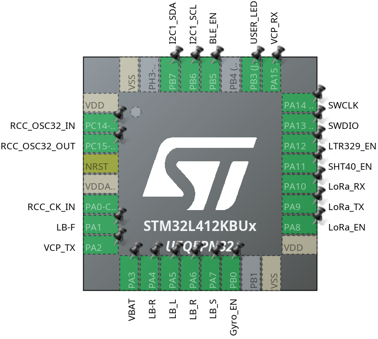
The connectivity to the SMT32L412.

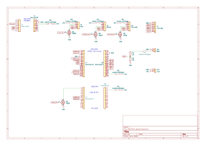The connectivity with all the other used modules

Final 