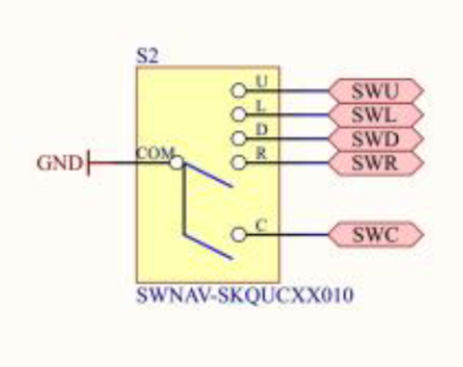
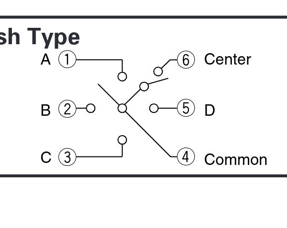

# How to communicate
Given the provided [LineBot code](https://github.com/RobbeElsermans/SSR/blob/main/linebot_os.zip), there are 3 ways to communicate between the brain module and the motors this bot:
- Use the build-in UART commands to control the bot.
- Create a I2C slave sketch for the bot and communicate via I2C.
- Find exposed pins and commnicate via GPIO.

Since the LoRa module already occupies one of the UARTs and the other is used for debug purposes, the first option isn't viable.
Due to time constraints, creating an I2C slave sketch wasn't feasible.
The only option left is to find exposed pins and try to communicate via GPIO.

# Finding the pins
In the [schematic](../../Datasheets/Linebot%20schematic.pdf) the pinout for a joystick can be found on the second page in the bottom left corner. This Joytsick is connected to the ground and 5 GPIO pins. These being PB3 up to PB7.



These pins are configured with interrupts, as can be seen in the provided code. Using the [datasheet of the joystick](../../Datasheets/skqucaa010_datasheet.pdf), it can be derived that the interrupts are active LOW (since the joystick will equal any pin chosen pin to the ground).



This means there are 5 interrupt pins available to communicate via GPIO.

# Control of the LineBot
The Mars rover needs to be able to execute the following actions, for it to drive around:
- Drive forward
- Drive backward
- Turn left
- Turn right
- Stop driving

For these 5 state, each will need a command. For it to work over GPIO, there will be a need of at least 3 pins (8 combinations).
** To keep the changes to the LineBot to a minimal (since it isn't the focus of this project), we'll use all 5 pins and actuate the each drive state. This way we can bind a command to an interrupt**

These changes can be applied by editing the StartupTask.h and StartupTask.c files:

- **StartupTask.h**
``` c
#ifndef STARTUP_TASK_H
#define STARTUP_TASK_H

/**
* First FreeRTOS task, inits the other tasks and drivers
* \file StartupTask.h
* \brief linebot init task
*/

/**
* \brief Initialization task
*/

void InitStartupTask(void);
void MotorSpeed();

#endif
```

- **StartupTask.c**
``` c
#include "StartupTask.h"

#include "FreeRTOS.h"
#include "task.h"

#include "DriverUSART.h"
#include "DriverCursorStick.h"
#include "DriverPower.h"
#include "DriverTwiMaster.h"
#include "Driverpl9823.h"
#include "DriverAdc.h"
#include "DriverLed.h"
#include "DriverMPU6050.h"
#include "DriverDbgUSART.h"
#include "DriverAdps9960.h"
#include "DriverOled.h"
#include "DriverVL53L0X.h"
#include "DriverMotor.h"

#include "OledMenuTask.h"
#include "MotorPosTask.h"
#include "MotorSpeedTask.h"
#include "ADCTask.h"
#include "LineFollowerSpeedTask.h"
#include "LineFollowerDirectTask.h"
#include "RGBTask.h"
#include "GyroTask.h"
#include "TerminalTask.h"
#include "MotionTask.h"

#include <stdio.h>

//Private function prototypes
static void WorkerStartup(void *pvParameters);

//Function definitions
void InitStartupTask() {
	xTaskCreate( WorkerStartup, "startup", 256, NULL, tskIDLE_PRIORITY+3, NULL );
}

  

static void WorkerStartup(void *pvParameters) {
	int res;
	
	DriverPowerVccAuxSet(1); //Enable Auxillary power line
	DriverCursorstickInit(); //Initialize cursor stick
	//DriverLedInit(); //Initialize LED's
	//DriverUSARTInit(); //USART init and link to stdio
	DriverPowerInit(); //Initialize aux power driver
	//DriverTWIMInit(); //Initialize TWI in master mode <-- oled
	DriverPL9823Init(); //Initialize PL9823 LEDs <--- Disable RGB leds
	//DriverAdcInit(); //Initialize ADC driver
	//DriverOLEDInit(2); //Initialize OLED display
	//DriverAdps9960Init(); //Initialize color sensor
	//DriverVL53L0XInit(); //Initialize rangefinder
	
	DriverMotorInit();
	
	vTaskDelay(50);
	
	//Enable test output (T21)
	//PORTA.DIRSET=1<<5;
	//Initialize application tasks
	
	//InitOLEDMenuTask(); // <-- oled
	//InitADCTask();
	InitMotorPosTask();
	InitMotorSpeedTask();
	//InitLineFollowerSpeedTask();
	
	//InitLineFollowerDirectTask();
	InitRGBTask(); // <--- Disable RGB leds
	//InitGyroTask();
	//InitTerminalTask();
	//InitMotionTask();
	
	MotorSpeed();
	
	vTaskSuspend(NULL);
}

  

void MotorSpeed() {
	uint8_t Stick;
	int16_t Speed1=0,Speed2=0;
	char s[32];
	
	while (1) {
	Stick=DriverCursorStickGetFifo(300);
	
		if (Stick & CURSOR_UP) {
			EnableMotorPosTask();
			EnableMotorSpeedTask();
			Speed1 = 1000;
			Speed2 = 1000;
		}
		
		if (Stick & CURSOR_DOWN) {
			EnableMotorPosTask();
			EnableMotorSpeedTask();
			Speed1 = -1000;
			Speed2 = -1000;
		}
		
		if (Stick & CURSOR_RIGHT) {
			EnableMotorPosTask();
			EnableMotorSpeedTask();
			Speed1 = -1000;
			Speed2 = 1000;
		}
		
		if (Stick & CURSOR_LEFT) {
			EnableMotorPosTask();
			EnableMotorSpeedTask();
			Speed1 = 1000;
			Speed2 = -1000;
		}
		
		if (Stick & CURSOR_PRESS) {
			MotorSpeedSet(0,0);
			vTaskDelay(300);
			DisableMotorSpeedTask();
			DisableMotorPosTask();
		}
		
		MotorSpeedSet(Speed1,Speed2);
	}
}
```

*Note: All the unused modules get disabled in this code.*