The server side will provide a place where the data can be stored and then be viewed via graph. For this project docker will be used to set up a:
- MongoDB server:              For data storage.
- Node-Red environment:   To receive the data, save it to the DB and graph it.

*If help is needed for this follow the steps on the [setup programs](Setup_Programs.md) page.
# Container installations
## Base containers commands
### MongoDB
The MongoDB instance will be used to store the received data, in case we want to view it on a later date. The settings of our MongoDB container will be based on the following commands:
``` bash
sudo docker pull mongodb/mongodb-community-server:latest
```
``` bash
sudo docker run --name mongodb -p 27017:27017 -d mongodb/mongodb-community-server:latest
```
The MongoDB terminal can be installed to check the data and found on the [setup programs](Setup_Programs.md) page.
### Node-Red
Node-Red is a simple tool, with which we can quickly set up:
- A MQTT receiver
- Dashboard
The settings of our Node-Red container will be based on the following commands.
``` bash
sudo docker pull nodered/node-red:latest
```
``` bash
sudo docker run -it -p 1880:1880 -v node_red_data:/data --name SSR-server nodered/node-red
```
## Docker compose
Using the following Docker compose file we can create both a MongoDB and Node-Red container that are capable of interacting with each other.
``` yaml
version: '1.0'

services:
  node-red:
    image: nodered/node-red				# Node-RED Docker image
    container_name: SSR-server				# Set the container name
    restart: always
    ports:
      - "1880:1880"					# Expose port 1880 for Node-RED
    volumes:
      - node_red_data:/data				# Persist data in a Docker volume
    networks:
      - app-network					# Attach to custom network
    environment:
      - MONGO_URL=mongodb://mongodb:27017		# MongoDB connection URL (use service name as host)
    entrypoint:
      - /bin/sh						# Use shell to execute commands
      - -c
      - |
        npm stop;					# Stop Node-RED
        npm install node-red-dashboard;			# Install dashboard nodes
        npm install node-red-contrib-mongodb4;		# Install MongoDB nodes
        npm start;                             		# Retart Node-RED
    # Enter the container with the following command:	sudo docker exec -it <container_id> bash

  mongodb:
    image: mongodb/mongodb-community-server:latest	# MongoDB Docker image
    container_name: SSR-DB				# Set container name for MongoDB
    restart: always
    ports:
      - "27017:27017"					# Expose MongoDB port
    volumes:
      - mongo_data:/data/db				# Persist MongoDB data in a Docker volume
    networks:
      - app-network					# Attach to custom network
    # environment:
      # MONGO_INITDB_ROOT_USERNAME: root
      # MONGO_INITDB_ROOT_PASSWORD: root

volumes:
  node_red_data:					# Volume for Node-RED data
  mongo_data:						# Volume for MongoDB data

networks:
  app-network:						# Define network for communication between containers
```
*Note that we will automatically install **the node-red-dashboard** & **node-red-contrib-mongodb4 packages**.*
# Back-end setup
Node-Red can be opened in any browser with the following URI:
``` URI
http://<IP-address>:1880
http://127.0.0.1:1880
```
## Load flow
The flow for the dashboard can be found under [SSR/LoRa/nodered.json](../../../../LoRa/nodered.json).
To load this flow in:
- Open node-red
- Press "ctrl-i"
- Click on the "select a file to import" button

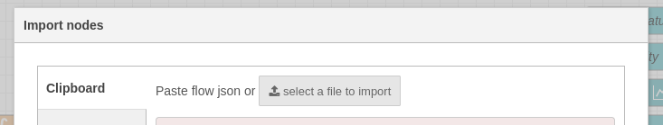

- Choose the file "nodered.json"
- Click on the "import" *button*

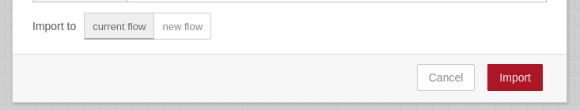
## LoRa connectivity
### MQTT network settings
In TTN terminal, click on the left onto the "Intigrations" tab and afterwards on the "MQTT" sub-tab. The following settings can be used to subscribe onto MQTT messages of this end device. *Note that the password needs to be generated.*

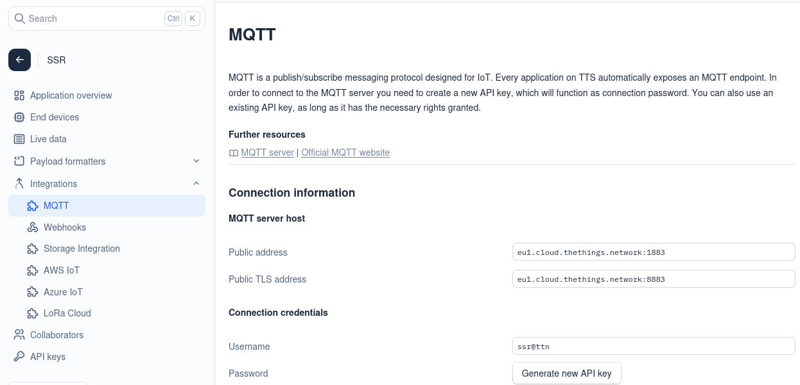
### MQTT node
Get a "mqtt in" node and put it in the flow, then click on it. A window should slide open. Click on the plus button next to the "server" to setup a connection to TheThingsNetwork.

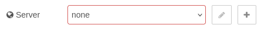

Setup server connection using the server host settings.

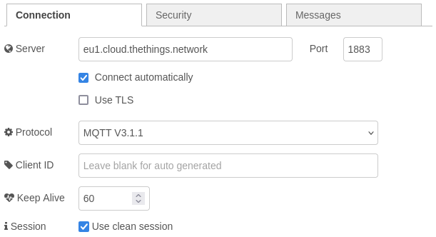

Setup server connection security using the connection credentials.

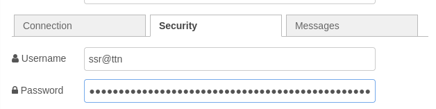

Subscribe to a certain topic. *For testing purposes we can use '#' as a any-topic*

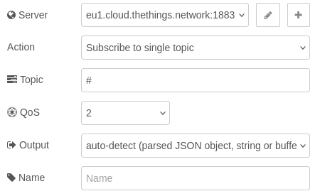
### Function node
Get a "function" node and put it in the flow, then click on it. A window should slide open.
In the "OnMessage" tab drop the following code:
``` js
// Decode Base64-encoded payload
const base64Payload = msg.payload.uplink_message.frm_payload;
const bytes = Buffer.from(base64Payload, 'base64'); // Decode Base64 to bytes

// Extract data from bytes
let ssr_data = {
	seq_number: (bytes[0] << 8) | bytes[1],
	env_temperature: (bytes[2] << 8) | bytes[3],
	env_humidity: bytes[4],
	env_lux: (bytes[5] << 8) | bytes[6],
	dev_voltage: (bytes[7] << 8) | bytes[8],
	dev_gyro_x: bytes[9],
	dev_gyro_y: bytes[10],
	dev_gyro_z: bytes[11]
};

// Set processed data to the message payload
msg.payload = ssr_data;
return msg;
```
### Debug node
Add last drop a "debug" node and put it in the flow, and connect:
1) The MQTT output to the function input.
2) The function output to the debug intput.

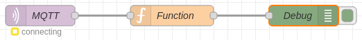
## Container connectivity
Add the following nodes to the flow:
- An **inject** node
- 2 **function** nodes
- A **[mongodb4](https://flows.nodered.org/node/node-red-contrib-mongodb4)**  node
- A **debug** node
Then connect them as follows:

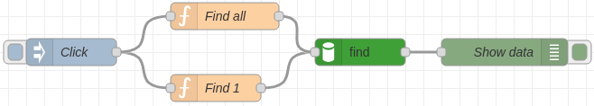
### Function nodes
Click on the "function" node. A window should slide open.
First let's make a find all function using the following code:
``` js
msg = {};
return msg;
```
Then let's make a find by ID function using the following code:
``` js
msg.payload = {hostname: "73e5846ccdd6"};
// 73e5846ccdd6 is example id found via the "Find all" node
return msg;
```
### MongoDB node
Click on the "mongodb4" node. A window should slide open.
Create a new connection:

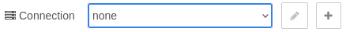

Set the simple URI settings to:
- **Hostname:** mongodb
- **Port:** 27017
- **Database:** local 

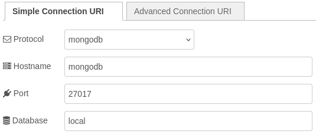

Set the advanced URI settings:
- **URI:** mongodb://mongodb:27017
- **Database:** local

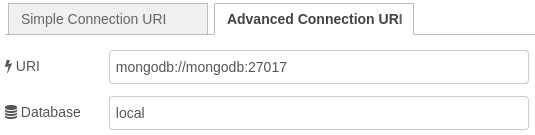

Set the global settings:
- **Mode:** collection operation
- **Collection:** *name-of-collection*
- **Operation:** find
- **Output:** toArray

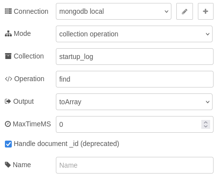
## Dashboard
### Function node
A dashboard can easily be created using the [dashboard nodes](https://flows.nodered.org/node/node-red-dashboard).
For this to work the data needs to be split using a function node:
- In the "Setup" tab, set the output to 8:

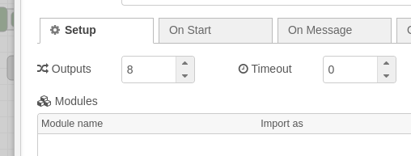

- In the "On Message" tab, paste the following code:
``` js
var ssr_data = msg.payload;

var snum_msg = { payload: msg.payload.seq_number };
var temp_msg = { payload: msg.payload.env_temperature/100 };
var hum_msg = { payload: msg.payload.env_humidity };
var lux_msg = { payload: msg.payload.env_lux };
var volt_msg = { payload: msg.payload.dev_voltage/1000 };
var gyrx_msg = { payload: msg.payload.dev_gyro_x*2 };
var gyry_msg = { payload: msg.payload.dev_gyro_y*2 };
var gyrz_msg = { payload: msg.payload.dev_gyro_z*2 };

return [
	snum_msg, temp_msg, hum_msg, lux_msg,
	volt_msg, gyrx_msg, gyry_msg, gyrz_msg
];
```

### Home screen
The dashboard can be opened in any browser with the following URI:
``` URI
http://<IP-address>:1880/ui/#!/0
http://127.0.0.1:1880/ui/#!/0
```

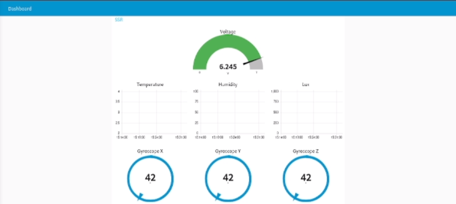