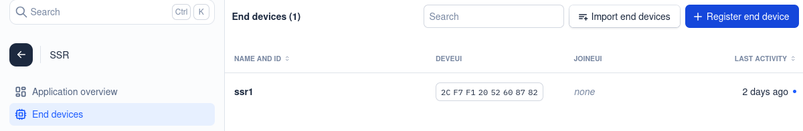
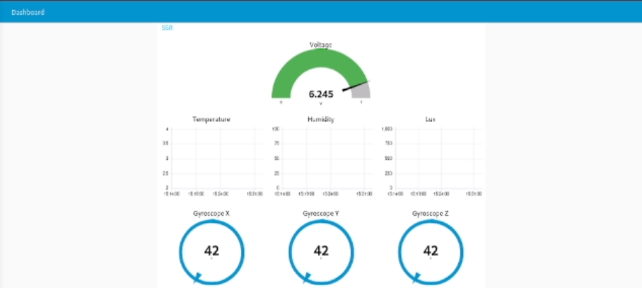
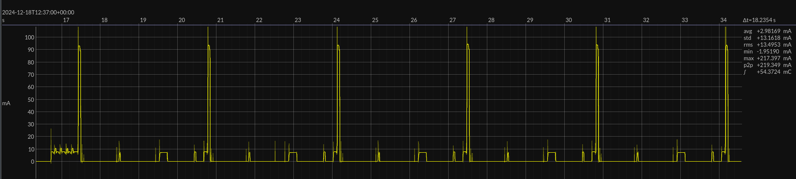
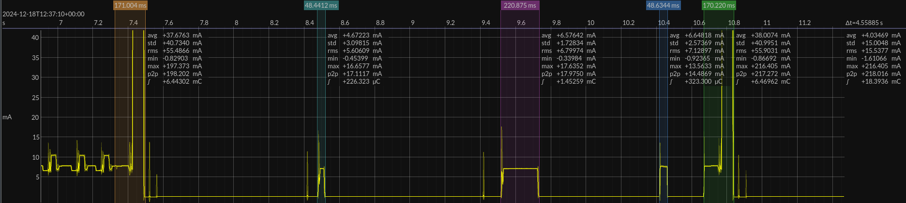

For the LoRa-Module, we utilize the [Wio-e5 mini board](https://wiki.seeedstudio.com/LoRa_E5_mini/).


*[Wio-e5 mini pinout](https://wiki.seeedstudio.com/LoRa_E5_mini/)*

*Some handy videos include: [setup device](https://www.youtube.com/watch?v=L_acKpwNvnc&list=WL&index=11&t=600s) & [setup MQTT](https://www.youtube.com/watch?v=9H6GFXatOCY&list=WL&index=12&t=128s)*
# Communications
## Diagram
The base communication flow is depicted in the block schematic below.


## Setup
To setup this network we will need to follow these steps:
1) Connect to the LoRa module via UART/Serial to change the modules configuration.
2) Connect the module to TheThingsNetwork *(TTN)*
3) Create a Node-Red environment and connect it to TTN network.
# Setup
## Connect to LoRA
First we will connect to the LoRa module, to change the modules configuration. This can be done via the USB-C port and a serial monitor. *This can be done via a program such as Putty or the ArduinoIDE serial terminal. ([Installation and setup](Setup_Programs.md))*
### UART/Serial settings
The standard UART/Serial settings the LoRa module uses are as follows:
- Baud-Rate:     9600
- Data Bits:        8
- Stop Bit:          1
- Parity:             None
- Flow Control: None


### AT commands
The LoRa module makes use of AT commands. All these commands can be found in this [document](../../Datasheets/Lora_Specifications.pdf#page=16).

To test the connection, we need to send the base AT command:
``` AT Command
AT
```

This should return an "OK"-message.


Once the connection has been set up and checked, we can start with getting the current configuration. This can be done using the following command:
``` AT Command
AT+ID
```


These can later be used to add the device to TTN.
### Configure mode
Since the communication from the rover to the servers is only one way, we decided to use ABP. In this manner the configuration can be hard-coded on the device. This can be done using the following command:
``` AT Command
AT+MODE="LWABP"
```


The device address can be changed using the following command:
``` AT Command
// With 260BC2D8 the address
AT+ID=DevAddr,"260BC2D8"
```


The device secret keys can be changed using the following commands:
``` AT Command
// With E91661F4C1D5172FE116CCDB137A3FDE the AppSKey
// With 06E55AEC9813D87693F0A42EAF441E93 the NwkSKey
AT+KEY=AppSKey,"E91661F4C1D5172FE116CCDB137A3FDE"
AT+KEY=NwkSKey,"06E55AEC9813D87693F0A42EAF441E93"
```


The device identifiers can be changed using the following commands:
``` AT Command
// With 2CF7F12052608782 as the DevEUI
AT+ID=DevEui,"2CF7F12052608782"
AT+ID=AppEui,"2CF7F12052608782"
```


### Configure channel communication
As previously established the module uses ABP mode.
``` AT Command
AT+MODE="LWABP"
```


To minimize the energy consumption *(and maximize data-rate for testing purposes)*, the LoRa module is set to "DR7". This has the lowest range with highest data rate. 
``` AT Command
AT+DR=7
```


For implementation on Mars, a higher range is better used *(DR0 with SF12 has a 5 times range increase)* and tested for energy consumption. This was not achieved in this project due to time constraints. 

A channel can be selected using the following command:
``` AT Command
AT+CH=num,0
```


The settings of this specific channel can then be changed using the following command:
``` AT Command
AT+CH=0, 868.1, DR0, DR5
```


The settings of this channel can be checked using the following command:
``` AT Command
AT+CH=0
```


### Send a message
To send a string message, use the following command:
``` AT Command
AT+MSG="*message*"
```


To send a hexadecimal message, use the following command:
``` AT Command
AT+MSGHEX="*message*"
```

### Other interesting commands
The "LOWPOWER" command will set the module in ultra low-power mode.
``` AT Command
AT+LOWPOWER
```
Any command *(even faulty ones)* can wake the module up after it has been set to sleep, thought the command itself won't be processed.
After waking up the host should wait at least 5ms to send the next command, so that the modem could get ready.

With the "POWER" command the transmit power can be set.
``` AT Command
AT+POWER=<Output Power>
```
This can be set to 20, 14, 11, 8, 5 or 2 dBm for the EU868 standard.

The LoRa module has an EEPROM of 256 bytes to save user data. Values have to be read and write byte per byte:
- Read:
``` AT Command
AT+EEPROM=<ADDR>
```
- Write:
``` AT Command
AT+EEPROM=<ADDR>,<VAL>
```
### Error messages
Any faulty command or setting will result in and error message. More information about the error messages can be found in this [document](../../Datasheets/Lora_Specifications.pdf#page=8) on page 3.


## Add the device to TTN
Create an account on TheThingsNetwork *(TTN)* and open the dashboard. *If help is needed for this follow the steps on the [setup programs](Setup_Programs.md) page.
### Create an application
Hover over the plus sign and click on "Add application".


Give the application a name and ID.


## Add a device
Under the "End devices" tab, click op the "Register end device" button.



Use the following settings to register an end device:
- DevEUI should be provided by the device. Use the device value.
- Device address, AppSKey & NwkSKey should be generated and then configured onto the end device.
- The chosen mode is APB.


## Create a dashboard
The server side will provide a place where the data can be stored and then be viewed via graph. For this project docker will be used to set up a:
- MongoDB server:              For data storage.
- Node-Red environment:   To receive the data, save it to the DB and graph it.

Since this is not as important for the scope of this project, the documentation of this part will be on a separate [page](Dashboard.md).


## Result
If everything is in order, communications between the module and back-end should be possible:


# Implementation
## Initialization
After waking up, the brain module will initialize the LoRa module with the right settings:
- Mode configuration
``` AT Command
AT+MODE="LWABP"
AT+ID=DevAddr,"260BC2D8"
AT+KEY=AppSKey,"E91661F4C1D5172FE116CCDB137A3FDE"
AT+KEY=NwkSKey,"06E55AEC9813D87693F0A42EAF441E93"
AT+ID=DevEui,"2CF7F12052608782"
AT+ID=AppEui,"2CF7F12052608782"
```
- Channel configuration
``` AT Command
AT+MODE="LWABP"
AT+DR=7
AT+CH=num,0
```
This way the settings are always correct, since they can be erased if the LoRa module is in sleep mode for too long.
## Sleep
The LoRa module be set to sleep between transmission.
``` AT Command
AT+LOWPOWER
```
As mentioned earlier, when the module is in sleep mode for duration longer than a couple of seconds it seemingly loses its configuration.

**Upon waking, after sleeping for longer than 10 seconds, the configuration should be reinitialized.**
## Sending
When sending the data, each data variable in the ssr_data struct will be concatenated and send as a 12-byte code:
``` AT Command
AT+MSGHEX="*12-byte hex code*"
```

```c
struct ssr_data
{
	uint16_t seq_number; // Range from 0 to 511 (8 bits total usage)
	int16_t env_temperature; // Range from -327.68 to 327.67 °C (val/100=°C)
	uint8_t env_humidity; // Range from -0-100%
	uint16_t env_lux; // Range from 0 to 1000
	uint16_t dev_voltage; // Range from 0-6.5535V (val/10000=V) (val/10=mV)
	int8_t dev_gyro_x; // Range from -125 to 125 (val*2=°)
	int8_t dev_gyro_y; // Range from -125 to 125 (val*2=°)
	int8_t dev_gyro_z; // Range from -125 to 125 (val*2=°)
};
typedef struct ssr_data ssr_data_t;
```

After a packet is received the module cannot send another message for at least 3 minutes, since TTN won't receive a package for that amount of time *(from the same device)*.

Out of testing, we have found that the LoRa module needs to transmit the message multiple times before it is received at the TTN. The following video show this phenomenon:


This can be due to:
- A bad connection to the gateway.
- Wrong settings during the configuration.
- Not having enough time between transmission, leading to collisions.

The amount of times that the transmission needs to be repeated drastically increases the shorter the time is between these repeated transmission. Only after 3.2 seconds do they stabilize at around ~58 TX / 1 RX.
- 1 second -> ~127 TX / 1 RX
- 2 second -> ~90 TX / 1 RX
- 3.2 second -> ~58 TX / 1 RX
- 5 seconds -> ~50 TX / 1 RX

So the best course of action when sending to the server is to follow this flow chart:


# Power consumption
## Power measurements of basic sweep
The power measurements have been performed over a 13,67 minute time span. Notable settings were:
- **Amount of repeats:** 64 TX / 1 RX
- **Time slept between RX:** 3 minutes (180 seconds)


This gave an average current of 1.338 mA.

$\text{power consumption} = \frac{1.338 \mathrm{mA} \cdot 823.434 \mathrm{s}}{3600} = 0.306 \mathrm{mAh}$

The average power consumption for these settings becomes 0.3 mAh.

The startup and repetition of the transmissions has the following current characteristic.

Between the repetitions, the LoRa module always wakes op at 3 moments. The cause for this is still unkown *(due to time constraints)*, but presumably these are the unsent RX messages from the LoRa module, since 9 peaks occur after the last repeated transmission.


## Measuring states
There are 4 state that can be measured:
- Idle state
- TX/RX command
- TX LoRa message
- Sleep state


| State      | Peak current (mA) | Average current (mA) | Duration (ms) | Consumption (mAh) |
| ---------- | ----------------- | -------------------- | ------------- | ----------------- |
| Sleep      | 0.038             | 0.034                | 101.177       | 0.000956          |
| Idle       | 7.714             | 7.909                | 70.687        | 0.001552          |
| UART TX/RX | 14.130            | 7.726                | 144.522       | 0.003097          |
| LoRA TX    | 204.733           | 40.399               | 157.915       | 0.017720          |
## Startup
When starting up or after being in sleep mode for a longer period, the setup AT commands are transmitted. This has the following current characteristic:


The fluctuations are most likely due to the AT commands being send *(and their response being received)*. It is not clear what the correlation between the two is, since their were 13 commands send and only 4 fluctuations occured.

This gave an average current of 7.707 mA over 676 ms (~1 minute).
## Repetition
When repeating transmissions the following current characteristic occurs:


|                | Peak current (mA) | Average current (mA) | Duration (ms) | Consumption (mAh) |
|:--------------:|:-----------------:|:--------------------:|:-------------:|:-----------------:|
| Repetition 1   | 197.373           | 37.676               | 171.000       | 0.001790          |
| Unknown wake 1 | 16.658            | 4.672                | 48.441        | 0.000063          |
| Unknown wake 2 | 17.635            | 6.576                | 220.875       | 0.000403          |
| Unknown wake 3 | 13.563            | 6.648                | 48.634        | 0.000090          |
| Repetition 2   | 216.405           | 38.001               | 170.220       | 0.001798          |

When applying the same calculations on the other repetitions, we get similar results *(except for the peak current that differs greatly from instance to instance)*.
## ON/OFF
Going back to the full range measurement, we will calculate the average current based on the different periods. These being:
- The startup and transmit repetition
- The lagging peaks
- The sleep mode


|                        | Peak current (mA) | Average current (mA) | Duration (ms) | Consumption (mAh) |
|:----------------------:|:-----------------:|:--------------------:|:-------------:|:-----------------:|
| Startup and repetition | 217.397           | 2.595                | 189.024       | 0.000137          |
| Lagging peaks          | 11.972            | 0.343                | 27.022        | 0.000003          |
| Sleep                  | 42.822            | 0.035                | 177.075       | 0.000002          |

$C_{\text{total}} = \left( 2.595 \times \frac{189.024}{3600000} \right) + \left( 0.343 \times \frac{27.022}{3600000} \right) + \left( 0.035 \times \frac{177.075}{3600000} \right) = 0.000137 + 0.000003 + 0.000002 = 0.000141 \mathrm{mAh}$

The power consumption *(for only the LoRa module)* of one received transmission would become 0.000141 mAh.