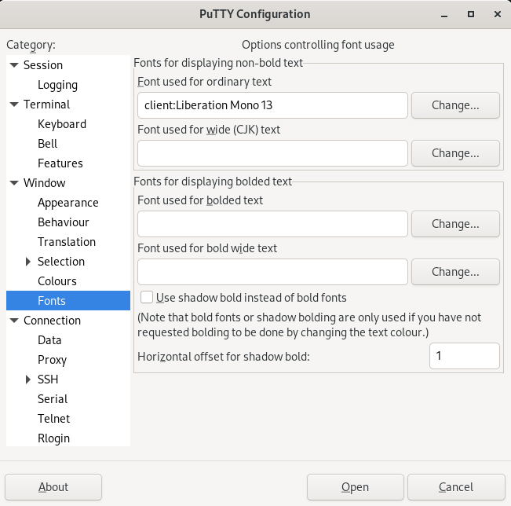
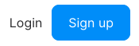
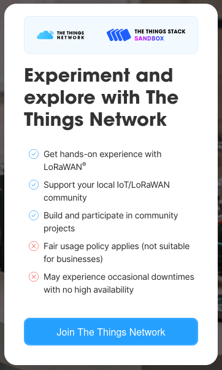
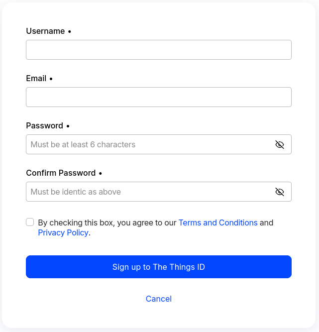
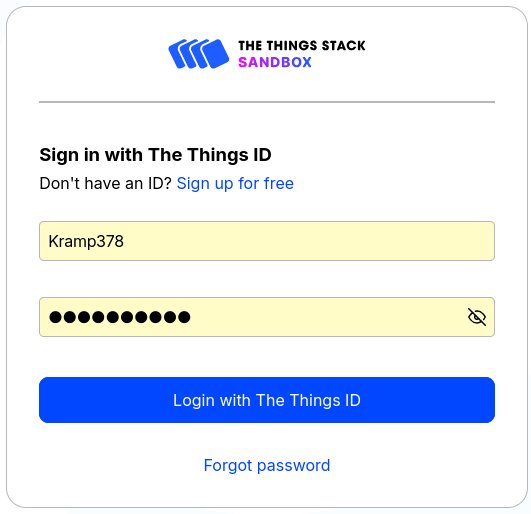
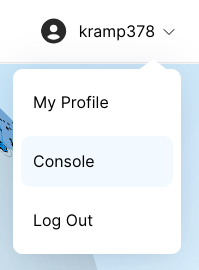
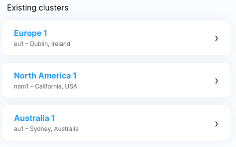
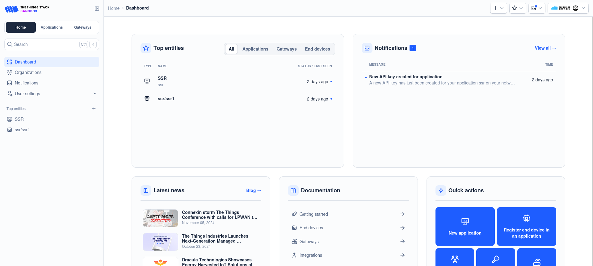

# Putty installation for Linux *(Debian)*
To install [Putty](https://www.chiark.greenend.org.uk/~sgtatham/putty/latest.html) on a Debian distribution use the following commands:
- Update system
``` bash
sudo apt update && sudo apt upgrade
```
- Install Putty
``` bash
sudo apt install putty putty-tools
```
- Verify installation
``` bash
putty --version
```
## Putty crash
If the terminal crashes after opening the connection, it might be due to the default font being faulty. Use the following settings:


# Arduino Installation
To install the ArduinoIDE, download the right package form this [link](https://www.arduino.cc/en/software).
# TTN account creation
Go to [TheThingsNetwork website](https://www.thethingsnetwork.org/) and click the Sign Up button:



Scroll down and click the *"Join the things network"* button:



Click the *"Sign in for free"*:


Create and account:



After creating and verifying your account, log in:


# Open TTN console
Click on the console button:



Select the closest cluster available *(Ireland)*:



You should see the following interface:


# Docker
Using docker we can easily create a separate instance of our back-end on new devices.
To [install docker on Linux](https://docs.docker.com/desktop/install/linux/debian/), take the following steps:
- Install Gnome:
``` bash
sudo apt install gnome-terminal
```
- Install Docker:
``` bash
sudo apt-get update
sudo apt-get install ./docker-desktop-amd64.deb
```
- Check installation:
``` bash
sudo docker --version
```
We will make a Docker compose file to easily reproduce our system.
# MongoDB
The MongoDB terminal can be installed to check the data.
``` bash
sudo apt-get install gnupg curl
```
``` bash
curl -fsSL https://www.mongodb.org/static/pgp/server-8.0.asc | \
   sudo gpg -o /usr/share/keyrings/mongodb-server-8.0.gpg \
   --dearmor
```
``` bash
echo "deb [ signed-by=/usr/share/keyrings/mongodb-server-8.0.gpg ] http://repo.mongodb.org/apt/debian bookworm/mongodb-org/8.0 main" | sudo tee /etc/apt/sources.list.d/mongodb-org-8.0.list
```
``` bash
sudo apt-get update
```