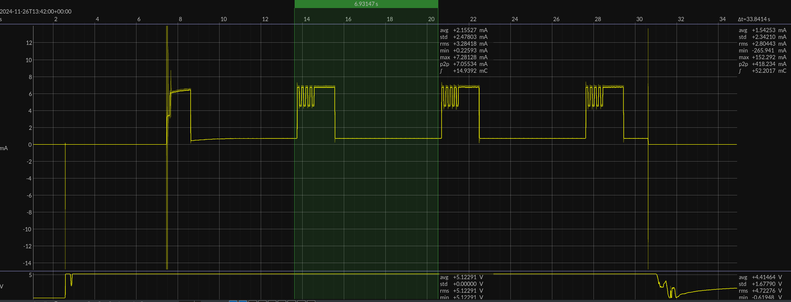
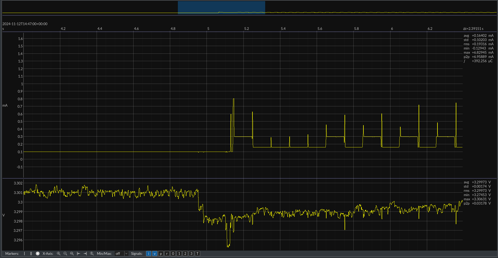
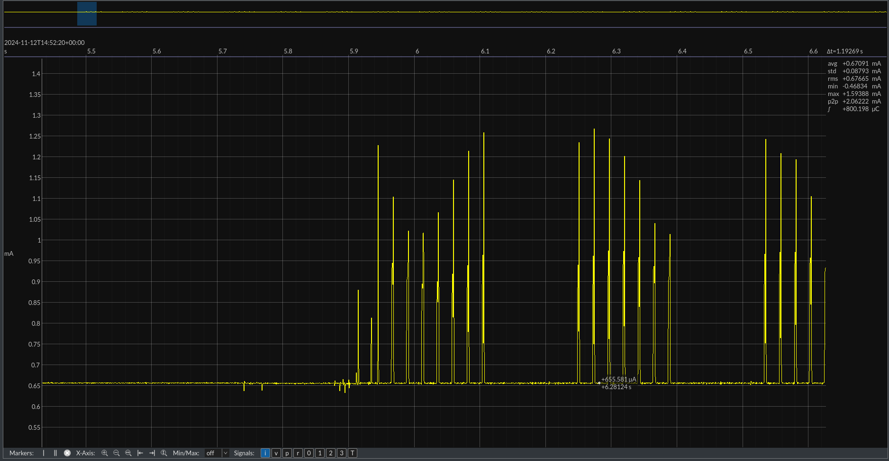

## Joule Scope Measurements
### STM32L4 
#### standby
This measurement is conducted by using JP1 with the Joule scope as amp meter.

The test code is the following pseudo code
```
while (1)
	init_all
	blink_led
	wait 5 seconds
	set pheripherals to go to sleep
	enter standby sleep
```

The Standby code will last for $33$ seconds when we use a prescaler of $/16$ at the Low power Oscillator of $\pm 32kHz$ and a compare value of $0xFFFF$ which yields in $\frac{16}{\pm32kHz} = 0.5ms$ and
$0.5ms \times 2^{16} = 32.768 \Rightarrow \pm 33 seconds$.

For the measurements , we have taken a compare value of $0x8FFF$ which yield in $0.5ms \times 36863 = 32.768 \Rightarrow \pm 18.5 seconds$.


We can deduct from this figure, the different steps
1. The high peak is the led that blinks for 1 second $\pm 12.6mA$.
2. Then, we wait for 5 seconds in running mode $\pm 10mA$
3. Later, we initialize sleep and go to sleep which results in a significant reduce of current consumption to $\pm 7.75µA$


A closer look at the standby mode current consumption.

The total cycle uses an average current of $\pm 2.7mA$.
This can be reduced by using a compare value of $0xFFFF$.
#### stop 2 mode
This power measurement is conducted on JP1.

The stop mode 2 is a low-power mode which let the STM32 to sleep and retain the RAM. This ensures us to continue where we left. Tis can be handy if we are waiting for measurements.
The code that is used for this:
```
while (1)
	blink 1 second
	sleep for 5 seconds in stop 2 mode
```


A current of $709µA$ is used when in stop mode 2.
To compare this while running, we have a consumption of $4.54mA$. This is a huge difference in consumption. Therefore, this stop mode 2 can surely be used.

We can also see that the while loop keeps running in loops and the RAM is fully retained.
### XIAO nRF52840 
#### peripheral mode
A small pseudo-code on what the device does 
```
setup 
	setup custom service
	setup custom charactersitic
	setup led
	setup BLE and Serial
	do Advertise
loop
	if connected to a central
		check value changes on charactersitic
		write led accordingly to value
```

The nRF52840 module will constantly be advertising on a rate of $100ms$ 
(this is default in ArduinoBLE see [ArduinoBLE-setAdvertisingInterval()](https://reference.arduino.cc/reference/en/libraries/arduinoble/ble.setadvertisinginterval/)).

On central connect, it will check constantly if the value has changed or not. The central is a smartphone which has the app nRF Connect installed and acts as a central.


Here, we can see the periodic advertisements that periodically occurs not every $100ms$, but around $40ms$. When the central connects to the peripheral, their is a heavily change of data present. Later, the central periodically checks the peripheral at a rate of $\pm 40ms$. This rate is defined by the smartphone. Weird. Further investigation is needed by manually setting the interval ranges and see if anything changes or not.


When connected, we can read and write the custom characteristic of the custom service. This characteristic's value is linked to an LED which is turned on and turned off as can be seen on the scope image above.


The square wave like structure with again a square wave like structure on top of it is unknown why this is happening. Further investigation is needed in order to know what this $\pm 2mA$ deviation is in current consumption.

Average consumption in advertising state is $11.12mA$.
Average consumption in connection state is $11.01mA$.

#### beacon mode
In the previous use case, we need an interconnection between 2 devices. This will not be the case in the next example.

Here, we use a beacon with a customized UUID (16-bytes). This UUID can be seen by anyone who is scanning. We use this UUID to transfer the data to remote nodes. The signal strength can be used to determine the distance between a beacon and a device.

pseudo-code of the program
```
setup 
	setup beacon advertisement
	wait for I2C connection
	get values over I2C
	do beacon for X amount of seconds (based on received value)

	set external wakeup pin
	Go to sleep
```
This results in the following power profile where we set the beacon interval to be 5 seconds, and the STM32L4 will periodically wake it up at $\pm33$ seconds.


The high peak is the *wait for I2C connection* which consumes lots of power ($\pm 13mA$).
Then, the beacon is transmitted for 5 seconds ($\pm0.46mA$) where after that, a deep sleep is entered which consumes $\pm 0.180mA$. 

This yields a result of $0.3566mA$ average consumption.

#### beacon low power mode
In this mode, the beacon gets an air-time of 10 seconds and after that, as sleep of $\pm14s$.
![[Pasted image 20241203130032.png]]
This configuration takes $\pm3.15mA$ over a period of 23 seconds.

![[Pasted image 20241203130320.png]]
The beacon itself consumes $\pm 6.44mA$.

In deep sleep, the beacon module consumes $\pm179.2µA$
#### scan low power mode

In this mode, the scanner gets an air-time of 10 seconds and after that, a sleep of $\pm 14s$.

![[BLE_Scan_Full_LPMode.png]]

This configuration takes $\pm5.26mA$  if no beacon is detected when scanning the medium.
The scanning itself consumes $\pm11.4mA$ which is quite a lot.

Compared to the beacon mode, the scanning mode consumes more power then the beacon mode. This is taken into consideration in the air-time of the BLE-modules modes.

As described in [nRF52 code description](../BLE_module/nRF52_SEEED_XIAO.md), the scanner will stop scanning when 1 beacon is found.
![[BLE_Scan_Half_LPMode.png]]

Here, a consumption of $\pm1.01mA$ is used over a period of 25 seconds. This is a reduction of $\pm5$ which is good.

In deep sleep, the beacon module consumes $\pm19.5µA$. 

>The huge difference between the beacon and scan mode is due to the powering method. Here, we power the board through 3.3V pin and in the beacon case, we power the board also through 3.3V pin. The difference is that in the beacon case, we use 2 pull-up resistors for the I2C communication which implies the higher current consumption.

### LTR-329 Light Sensor
#### Default operation
Joule scope is used as amp meter (by using only the red wires).


#todo
### SHT40 Light Sensor
Joule scope is used as amp meter (by using only the red wires).


#todo 
### LoRa Module
#todo