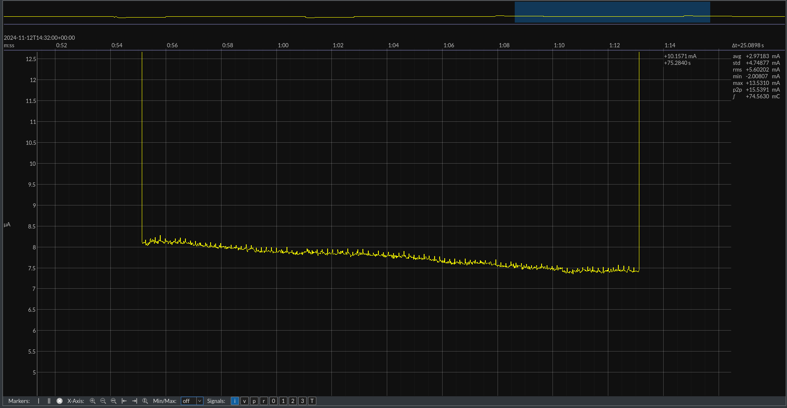
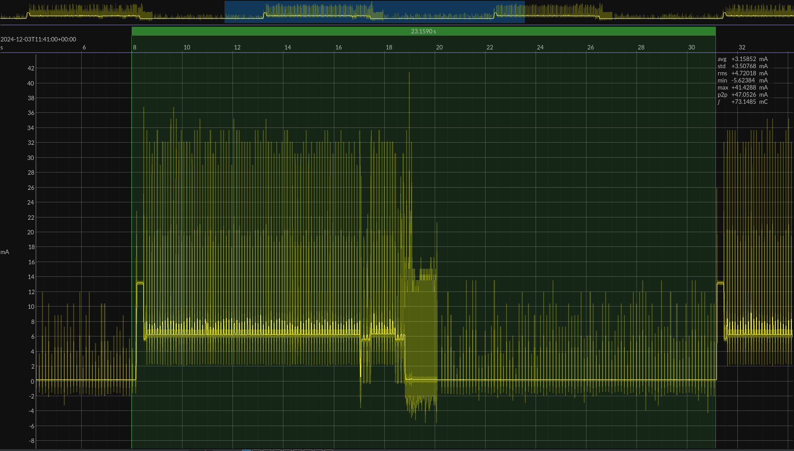
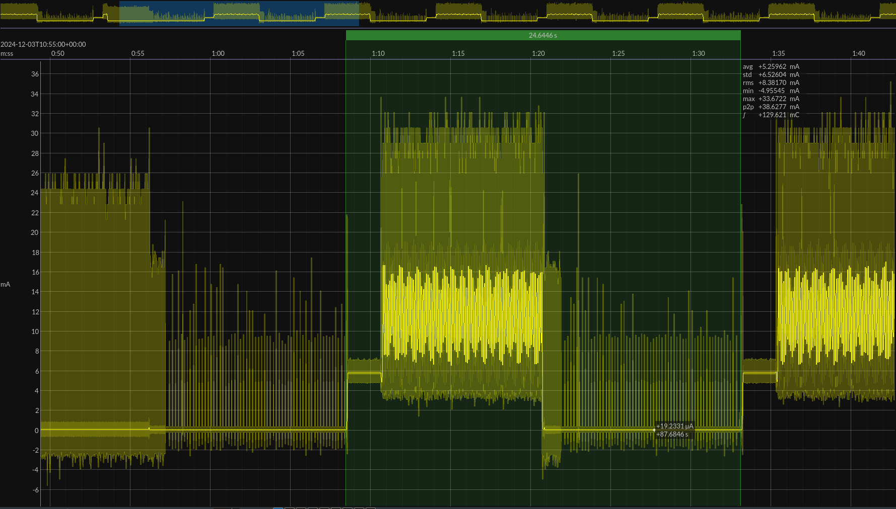

## Joule Scope Measurements

### STM32L412KB 

#### Standby Mode
This measurement is conducted using JP1 with the Joule Scope as an ammeter.

**Pseudo-code for Test:**
```
while (1)
	init_all
	blink_led
	wait 5 seconds
	set peripherals to go to sleep
	enter standby sleep
```

The standby mode lasts for approximately **33 seconds** with a prescaler of `/16` at the low-power oscillator (~32kHz) and a compare value of `0xFFFF`. Calculations:
- Clock interval: \( \frac{16}{32kHz} = 0.5ms \)
- Duration: \( 0.5ms \times 2^{16} = 32.768 \approx 33 \text{ seconds} \)

For measurements, a compare value of `0x8FFF` was used, resulting in \( 0.5ms \times 36863 = 18.5 \text{ seconds} \).


**Key Observations:**
1. **High Peak:** Blinking LED for 1 second (~12.6mA).
2. **Running Mode:** Waiting for 5 seconds (~10mA).
3. **Sleep Initialization:** Current reduces significantly to ~7.75µA.



**Average Current Consumption:** ~2.7mA per cycle.

This can be further reduced by using a compare value of `0xFFFF`.

#### Improved Standby Mode (Without Peripheral Load)


- **Lowest Point:** ~300nA.
- **Peak:** ~11mA.
- **Semi-Peak:** ~8.8mA.

During initialization, the STM32 fully reinitializes. This is evident in the brief duration before the LED turns on, which is absent in other graphs.

#### Stop 2 Mode

This power measurement is conducted on JP1. 

**Description:** Stop Mode 2 allows the STM32 to sleep while retaining RAM, enabling the device to continue seamlessly from where it left off. 

**Pseudo-code for Test:**
```
while (1)
	blink 1 second
	sleep for 5 seconds in stop 2 mode
```


**Observations:**
- Stop Mode 2 current: ~709µA.
- Running mode current: ~4.54mA.

Stop Mode 2 offers significant power savings and allows the while loop to keep running while retaining RAM.

#### Global Comparison
A global comparison was performed for delay, Stop Mode 2, and standby mode using the following code:
```c
init();
while(1)
{
	// Blinky blinky
	blink_led(1000);
	HAL_Delay(2000);

	// Change these accordingly to the mode we want
	// half_sleep(5000); // Stop Mode 2
	// deep_sleep(5000); // Standby Mode
	// HAL_Delay(5000); // Plain waiting
}
```

##### Normal Delay


##### Stop 2 Mode


##### Standby Mode


##### Conclusion
- **Stop 2 Mode** should replace any plain delay in code to achieve significant power savings while retaining RAM.
- Use **Standby Mode** for even greater power reduction when RAM retention is unnecessary.


In mAh this results in:
- **Delay**: $\frac{26.4s - 17.3s}{60*60 s/h}*9.24mA = 0.023357mAh$
- **Stop 2**: $\frac{10.75s - 1.2s}{60*60 s/h}*4.3mA = 0.011407mAh$
- **Standby**: $\frac{34.4s - 25s}{60*60 s/h}*4.35mA = 0.011358mAh$

### XIAO nRF52840

#### Peripheral Mode

**Pseudo-code for Test:**
```
setup 
	setup custom service
	setup custom characteristic
	setup led
	setup BLE and Serial
	do Advertise

loop
	if connected to a central
		check value changes on characteristic
		write led accordingly to value
```

The nRF52840 module advertises at a default rate of **100ms** (as per [ArduinoBLE-setAdvertisingInterval()](https://reference.arduino.cc/reference/en/libraries/arduinoble/ble.setadvertisinginterval/)).

**Power Profile Observations:**
1. Periodic advertisements occur around ~40ms (not the expected 100ms).
2. When connected to a central (via nRF Connect app), periodic checks occur at ~40ms intervals.


- Average advertising state consumption: ~11.12mA.
- Average connection state consumption: ~11.01mA.

**Anomalies:**

- Observed ~2mA deviations in current consumption, requiring further investigation.

#### Beacon Mode

In this mode, the nRF52840 broadcasts a customized UUID (16-bytes) for data transfer to remote nodes. 

**Pseudo-code for Test:**
```
setup 
	setup beacon advertisement
	wait for I2C connection
	get values over I2C
	do beacon for X amount of seconds (based on received value)

	set external wakeup pin
	go to sleep
```

**Power Profile:**
- Beacon interval: **5 seconds**.
- STM32L4 wakes every ~33 seconds.


**Key Observations:**
1. **Wait for I2C connection:** ~13mA.
2. **Beacon Transmission:** ~0.46mA for 5 seconds.
3. **Deep Sleep:** ~0.002mA.

**Average Current Consumption:** ~0.3566mA for $33s$ or $0.003268833mAh$.

#### Beacon Low Power Mode

**Configuration:** Beacon air-time of 10 seconds followed by ~14 seconds of sleep.



- Total average consumption: ~3.15mA over 23 seconds.
- Beacon mode consumption: ~6.44mA.
- Deep sleep consumption: ~179.2µA (higher than datasheet specifications).

> Later on in this page, We figured out why it was so high.

#### Scan Low Power Mode

**Configuration:** Scanner air-time of 10 seconds followed by ~14 seconds of sleep.


- Average consumption (no beacons detected): ~5.26mA.
- Scanning itself: ~11.4mA.

**Optimized Scan Mode:**
If a beacon is detected, scanning stops immediately, significantly reducing consumption:


- Optimized consumption: ~1.01mA over $25s$ or $0.00701388mAh$.

#### Power Comparison

For minimal power usage, BLE modules should be in the lowest power mode when waiting for triggers from the STM32 module.

**Test Code:**
```c
init();
while(1)
{
	digitalWrite(LED_BUILTIN, LOW);
	delay(1000);
	digitalWrite(LED_BUILTIN, HIGH);  
	delay(1000);

	// Normal mode
	while(!digitalRead(2)) //Wait for pin change
	{
		//normal
		//delay(1000); //normal modified
	}
	// End normal mode

	// deep sleep mode
	// deep_sleep(); //Wake-up based on external pin change
	// End deep sleep mode
}
```
##### No delay
Below a graph where the normal modified is used (so no delay in the while).

A high consumption is present in the while loop with no delay. here, the PMU doesn't get time to decrease energy between CPU cycles. Therefore the full power consumption.

##### Delay (NOPs)
Below a graph where the normal modified is used (so a delay is used).

A weird spike happens when the led is on.
##### Deep Sleep

Below a graph when system off is used.

The difference between the modified delay is that here, we have a reduction of 2. This is not much but more then nothing.

**Key Observations:**
- Using a delay of 1 second vs. deep sleep yields similar power consumption (half power reduced).
- Delay retains RAM, ensuring faster wake-up (~1 second) compared to deep sleep.

> **A problem we've encountered**
The used module has for some reasons a current consumption of 179µA in deep sleep. This should be lower. Therefore, another module is used to eliminate faults. This other module yields different values, which are correct accordingly to the datasheet, with the same code. We where measuring with a defect module! All plots are done with the correct module.


In mAh this results in:
- **No delay**: $\frac{52.5s - 42.1s}{60*60 s/h}*5.266mA = 0.015213mAh$
- **Delay (NOPs)**: $\frac{8.9s - 0.15s}{60*60 s/h}*0.363mA = 0.00088229mAh$
- **Deep Sleep**: $\frac{47.1s - 38.2s}{60*60 s/h}*0.08147mA = 0.0002014119mAh$


### LTR-329 Light Sensor
```c
init();
while(1)
{
	// Normal mode
	while(1) //Wait for pin change
	{
		read_sensor();
		wait 10 sec
	}
}
```

#### Default Operation


#### Standby mode

- Active: 171.5µA
- Idle: 80µA
- Total: 85.1µA or $0.00025482mAh$

### SHT40 Sensor

#### Default Operation
This operations implies a constant readout of the sensor. 


#### Standby Mode
In standby mode, the module will be brought out of standby and we let the module measure once. After 1 measurement, we put it back to standby mode.

- Active: 121.14µA
- Idle: 115.54µA
- Total: 115.80µA or $0.0000348mAh$

### Sensors Power Measurement
A global comparison of constantly running mode versus the standby mode.


### LoRa Module
#### Power measurements of basic sweep
The power measurements have been performed over a 13,67 minute time span. Notable settings were:
- **Amount of repeats:** 64 TX / 1 RX
- **Time slept between RX:** 3 minutes (180 seconds)


This gave an average current of 1.338 mA.

$\text{power consumption} = \frac{1.338 \mathrm{mA} \cdot 823.434 \mathrm{s}}{3600} = 0.306 \mathrm{mAh}$

The average power consumption for these settings becomes 0.3 mAh.

The startup and repetition of the transmissions has the following current characteristic.

Between the repetitions, the LoRa module always wakes op at 3 moments. The cause for this is still unkown *(due to time constraints)*, but presumably these are the unsent RX messages from the LoRa module, since 9 peaks occur after the last repeated transmission.


#### Measuring states
There are 4 state that can be measured:
- Idle state
- TX/RX command
- TX LoRa message
- Sleep state


| State      | Peak current (mA) | Average current (mA) | Duration (ms) | Consumption (mAh) |
| ---------- | ----------------- | -------------------- | ------------- | ----------------- |
| Sleep      | 0.038             | 0.034                | 101.177       | 0.000956          |
| Idle       | 7.714             | 7.909                | 70.687        | 0.001552          |
| UART TX/RX | 14.130            | 7.726                | 144.522       | 0.003097          |
| LoRA TX    | 204.733           | 40.399               | 157.915       | 0.017720          |
#### Startup
When starting up or after being in sleep mode for a longer period, the setup AT commands are transmitted. This has the following current characteristic:


The fluctuations are most likely due to the AT commands being send *(and their response being received)*. It is not clear what the correlation between the two is, since their were 13 commands send and only 4 fluctuations occured.

This gave an average current of 7.707 mA over 676 ms (~1 minute).
#### Repetition
When repeating transmissions the following current characteristic occurs:


|                | Peak current (mA) | Average current (mA) | Duration (ms) | Consumption (mAh) |
|:--------------:|:-----------------:|:--------------------:|:-------------:|:-----------------:|
| Repetition 1   | 197.373           | 37.676               | 171.000       | 0.001790          |
| Unknown wake 1 | 16.658            | 4.672                | 48.441        | 0.000063          |
| Unknown wake 2 | 17.635            | 6.576                | 220.875       | 0.000403          |
| Unknown wake 3 | 13.563            | 6.648                | 48.634        | 0.000090          |
| Repetition 2   | 216.405           | 38.001               | 170.220       | 0.001798          |

When applying the same calculations on the other repetitions, we get similar results *(except for the peak current that differs greatly from instance to instance)*.
#### ON/OFF
Going back to the full range measurement, we will calculate the average current based on the different periods. These being:
- The startup and transmit repetition
- The lagging peaks
- The sleep mode


|                        | Peak current (mA) | Average current (mA) | Duration (ms) | Consumption (mAh) |
|:----------------------:|:-----------------:|:--------------------:|:-------------:|:-----------------:|
| Startup and repetition | 217.397           | 2.595                | 189.024       | 0.000137          |
| Lagging peaks          | 11.972            | 0.343                | 27.022        | 0.000003          |
| Sleep                  | 42.822            | 0.035                | 177.075       | 0.000002          |

$C_{\text{total}} = \left( 2.595 \times \frac{189.024}{3600000} \right) + \left( 0.343 \times \frac{27.022}{3600000} \right) + \left( 0.035 \times \frac{177.075}{3600000} \right) = 0.000137 + 0.000003 + 0.000002 = 0.000141 \mathrm{mAh}$

The power consumption *(for only the LoRa module)* of one received transmission would become 0.000141 mAh.