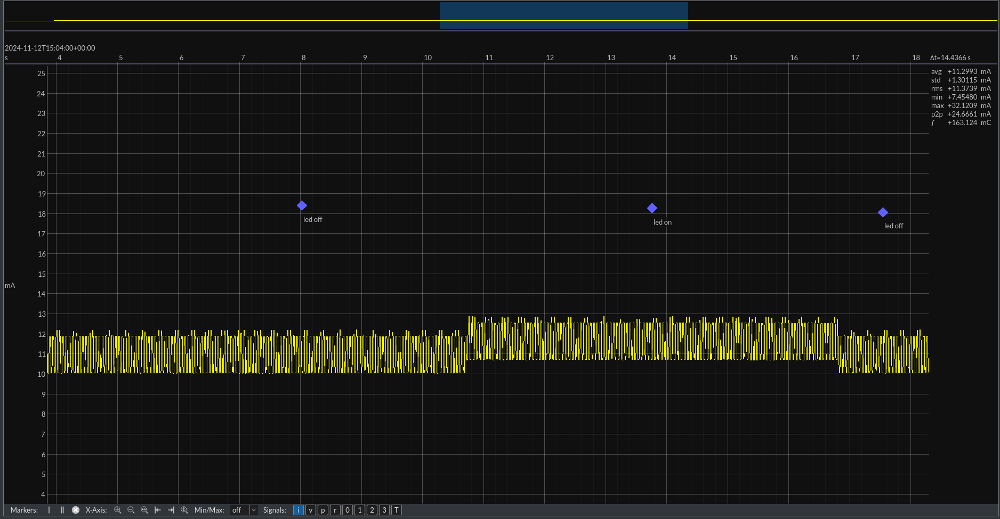

## Joule Scope Measurements

### STM32L4 

#### Standby Mode
This measurement is conducted using JP1 with the Joule Scope as an ammeter.

**Pseudo-code for Test:**
```
while (1)
	init_all
	blink_led
	wait 5 seconds
	set peripherals to go to sleep
	enter standby sleep
```

The standby mode lasts for approximately **33 seconds** with a prescaler of `/16` at the low-power oscillator (~32kHz) and a compare value of `0xFFFF`. Calculations:
- Clock interval: \( \frac{16}{32kHz} = 0.5ms \)
- Duration: \( 0.5ms \times 2^{16} = 32.768 \approx 33 \text{ seconds} \)

For measurements, a compare value of `0x8FFF` was used, resulting in \( 0.5ms \times 36863 = 18.5 \text{ seconds} \).


**Key Observations:**
1. **High Peak:** Blinking LED for 1 second (~12.6mA).
2. **Running Mode:** Waiting for 5 seconds (~10mA).
3. **Sleep Initialization:** Current reduces significantly to ~7.75µA.


**Average Current Consumption:** ~2.7mA per cycle.

This can be further reduced by using a compare value of `0xFFFF`.

#### Improved Standby Mode (Without Peripheral Load)


- **Lowest Point:** ~300nA.
- **Peak:** ~11mA.
- **Semi-Peak:** ~8.8mA.

During initialization, the STM32 fully reinitializes. This is evident in the brief duration before the LED turns on, which is absent in other graphs.

#### Stop 2 Mode

This power measurement is conducted on JP1. 

**Description:** Stop Mode 2 allows the STM32 to sleep while retaining RAM, enabling the device to continue seamlessly from where it left off. 

**Pseudo-code for Test:**
```
while (1)
	blink 1 second
	sleep for 5 seconds in stop 2 mode
```


**Observations:**
- Stop Mode 2 current: ~709µA.
- Running mode current: ~4.54mA.

Stop Mode 2 offers significant power savings and allows the while loop to keep running while retaining RAM.

#### Global Comparison
A global comparison was performed for delay, Stop Mode 2, and standby mode using the following code:
```c
init();
while(1)
{
	// Blinky blinky
	blink_led(1000);
	HAL_Delay(2000);

	// Change these accordingly to the mode we want
	// half_sleep(5000); // Stop Mode 2
	// deep_sleep(5000); // Standby Mode
	// HAL_Delay(5000); // Plain waiting
}
```

##### Normal Delay


##### Stop Mode 2


##### Standby Mode


##### Conclusion
- **Stop Mode 2** should replace any plain delay in code to achieve significant power savings while retaining RAM.
- Use **Standby Mode** for even greater power reduction when RAM retention is unnecessary.


### XIAO nRF52840

#### Peripheral Mode

**Pseudo-code for Test:**
```
setup 
	setup custom service
	setup custom characteristic
	setup led
	setup BLE and Serial
	do Advertise

loop
	if connected to a central
		check value changes on characteristic
		write led accordingly to value
```

The nRF52840 module advertises at a default rate of **100ms** (as per [ArduinoBLE-setAdvertisingInterval()](https://reference.arduino.cc/reference/en/libraries/arduinoble/ble.setadvertisinginterval/)).

**Power Profile Observations:**
1. Periodic advertisements occur around ~40ms (not the expected 100ms).
2. When connected to a central (via nRF Connect app), periodic checks occur at ~40ms intervals.




- Average advertising state consumption: ~11.12mA.
- Average connection state consumption: ~11.01mA.

**Anomalies:**

- Observed ~2mA deviations in current consumption, requiring further investigation.

#### Beacon Mode

In this mode, the nRF52840 broadcasts a customized UUID (16-bytes) for data transfer to remote nodes. 

**Pseudo-code for Test:**
```
setup 
	setup beacon advertisement
	wait for I2C connection
	get values over I2C
	do beacon for X amount of seconds (based on received value)

	set external wakeup pin
	go to sleep
```

**Power Profile:**
- Beacon interval: **5 seconds**.
- STM32L4 wakes every ~33 seconds.


**Key Observations:**
1. **Wait for I2C connection:** ~13mA.
2. **Beacon Transmission:** ~0.46mA for 5 seconds.
3. **Deep Sleep:** ~0.002mA.

**Average Current Consumption:** ~0.3566mA.

#### Beacon Low Power Mode

**Configuration:** Beacon air-time of 10 seconds followed by ~14 seconds of sleep.


- Total average consumption: ~3.15mA over 23 seconds.
- Beacon mode consumption: ~6.44mA.
- Deep sleep consumption: ~179.2µA (higher than datasheet specifications, requiring register investigation).

#### Scan Low Power Mode

**Configuration:** Scanner air-time of 10 seconds followed by ~14 seconds of sleep.


- Average consumption (no beacons detected): ~5.26mA.
- Scanning itself: ~11.4mA.

**Optimized Scan Mode:**
If a beacon is detected, scanning stops immediately, significantly reducing consumption:


- Optimized consumption: ~1.01mA over 25 seconds.

#### Power Comparison

For minimal power usage, BLE modules should be in the lowest power mode when waiting for triggers from the STM32 module.

**Test Code:**
```c
init();
while(1)
{
	digitalWrite(LED_BUILTIN, LOW);
	delay(1000);
	digitalWrite(LED_BUILTIN, HIGH);  
	delay(1000);

	// Normal mode
	while(!digitalRead(2)) //Wait for pin change
	{
		//normal
		//delay(1000); //normal modified
	}
	// End normal mode

	// deep sleep mode
	// deep_sleep(); //Wake-up based on external pin change
	// End deep sleep mode
}
```
Below a graph where the normal modified is used (so no delay in the while).
![[Pasted image 20241218093041.png]]
A high consumption is present in the while loop with no delay. here, the PMU doesn't get time to decrease energy between CPU cycles. Therefore the full power consumption.

Below a graph where the normal modified is used (so a delay is used).
![[Pasted image 20241218092342.png]]
A weird spike happens when the led is on.

Below a graph when system off is used.
![[Pasted image 20241218091811.png]]
The difference between the modified delay is that here, we have a reduction of 2. This is not much but more then nothing.

**Key Observations:**
- Using a delay of 1 second vs. deep sleep yields similar power consumption.
- Delay retains RAM, ensuring faster wake-up (~1 second) compared to deep sleep.

A problem we've encountered.
The used module has for some reasons a current consumption of 0.179µA. This should be lower. Therefore, another module is used with the same code and yields different values which are correctly accordingly to the datasheet.
![[Pasted image 20241218092955.png]]
### LTR-329 Light Sensor
```c
init();
while(1)
{
	// Normal mode
	while(1) //Wait for pin change
	{
		read_sensor();
		wait 10 sec
	}
}
```

#### Default Operation


#### Standby mode
![[Pasted image 20241218101025.png]]
- Active: 171.5µA
- Idle: 80µA
- Total: 85.1µA

### SHT40 Sensor

#### Default Operation


#### Standby Mode
![[Pasted image 20241218102531.png]]
- Active: 121.14µA
- Idle: 115.54µA
- Total: 115.80µA

### Sensors Power Measurement


### LoRa Module
**(To be documented)**

