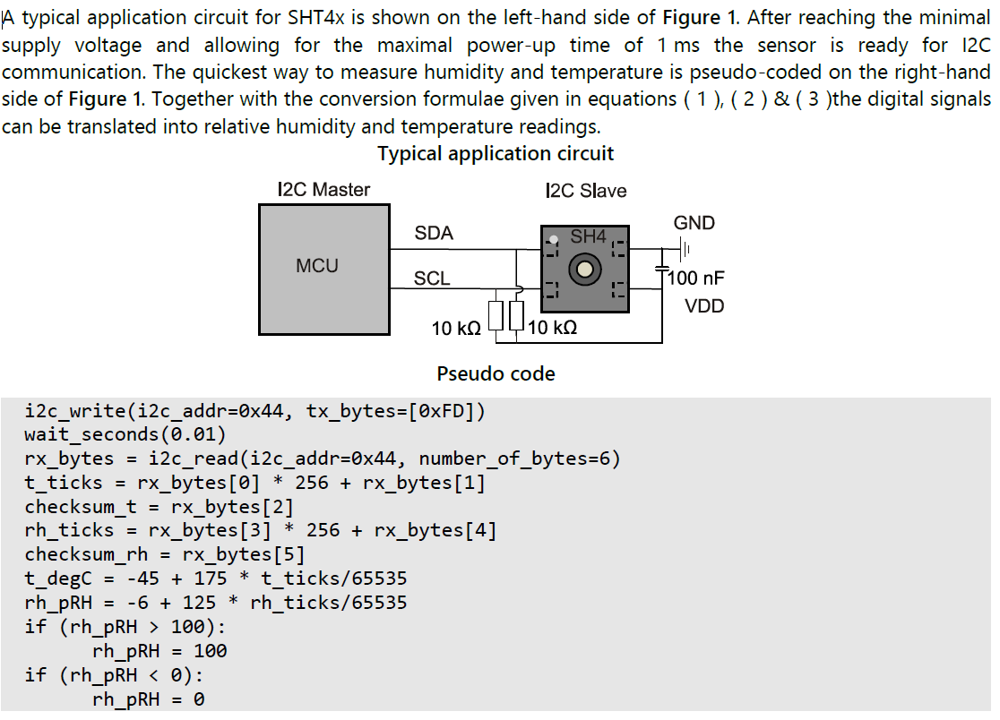
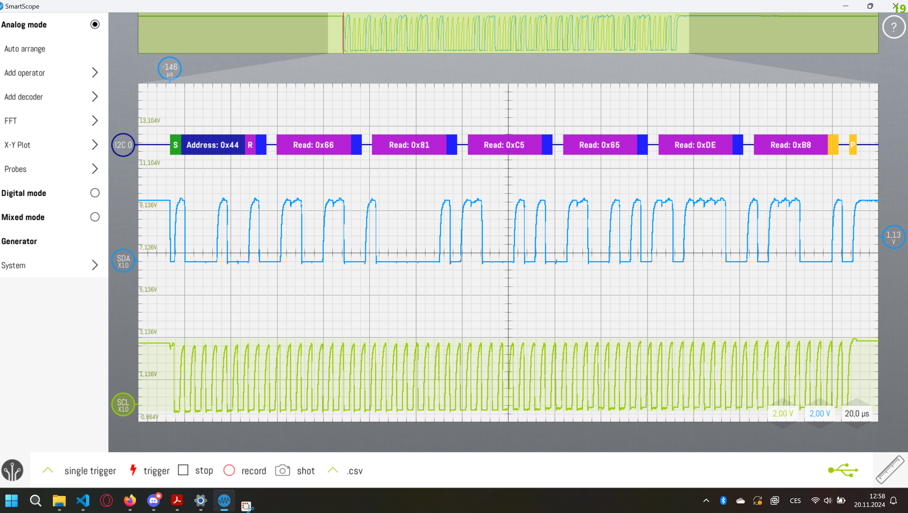

![[HT_DS_Datasheet_SHT4x.pdf]]

SHT4x is a digital sensor platform for measuring relative humidity and temperature at different accuracy classes. Its I2C interface provides several preconfigured I2C addresses while maintaining an ultra-low power budget.





Sensor read function:
```C
void SHT40_ReadSensor(void)

{

  HAL_StatusTypeDef ret;

  uint8_t data_tx[1] = {0xFD};

  uint8_t data_rx[6];

  ret = HAL_I2C_Master_Transmit(&hi2c1, 0x44 << 1, data_tx, 1, 1000);

  if (ret != HAL_OK)

  {

    char Buffer[25] = {0};

    sprintf(Buffer, "Error\r\n");

    HAL_UART_Transmit(&huart2, Buffer, sizeof(Buffer), HAL_MAX_DELAY);

    HAL_Delay(1000);

  }

  else

  {

    // read bytes

    HAL_Delay(1000);

    ret = HAL_I2C_Master_Receive(&hi2c1, 0x44 << 1, data_rx, 6, 1000);

    if (ret != HAL_OK)

    {

      char Buffer[25] = {0};

      sprintf(Buffer, "Error\r\n");

      HAL_UART_Transmit(&huart2, Buffer, sizeof(Buffer), HAL_MAX_DELAY);

      HAL_Delay(1000);

    }

    else

    {

      for (int i = 0; i < 6; i++)

      {

        char Buffer[25] = {0};

        sprintf("data_rx[%i] = %u \n", i, data_rx[i]);

        HAL_UART_Transmit(&huart2, Buffer, sizeof(Buffer), HAL_MAX_DELAY);

      }

      float t_ticks = data_rx[0] * 256 + data_rx[1];

      float rh_ticks = data_rx[3] * 256 + data_rx[4];

  

      int temp = -45 + 175 * t_ticks / 65535;

      int hum = -6 + (125.0 * rh_ticks) / 65535.0;

  

      char Buffer[25] = {0};

  

      sprintf(Buffer, "temp: %d, hum :  %d\r\n", temp, hum);

      HAL_UART_Transmit(&huart2, Buffer, sizeof(Buffer), HAL_MAX_DELAY);

      HAL_Delay(2000);

    }

  }

```



Some conclusions: 
- address can range from 0x44 to 0x46.
- Idle current = $0.08\mu A$
- Power up current = $50\mu A$
- Measurement $320\mu A$
- 3 repeatability modes to receive the mean values. Each their own current consumption.
- Read (high prec.) 0xFD -> [2 * 8-bit T-data; 8-bit CRC; 2 * 8-bit RH-data; 8-bit CRC]
- Read (med prec.) 0xF6 -> [2 * 8-bit T-data; 8-bit CRC; 2 * 8-bit RH-data; 8-bit CRC]
- Read (low prec.) 0xE0 -> [2 * 8-bit T-data; 8-bit CRC; 2 * 8-bit RH-data; 8-bit CRC]
$RH = ( -6 + 125 \cdot \frac{S_{RH}}{2^{16} -1}) (\%RH)$
$T = ( -45 + 175 \cdot \frac{S_{T}}{2^{16} -1}) (^\circ C)$
[SHT40_standby_mode](../../Images/Power_Profiling/SH40_standby_mode.png)
![[SHT40_standby_mode.png]]


This sensor took me soooo long to communicate with
