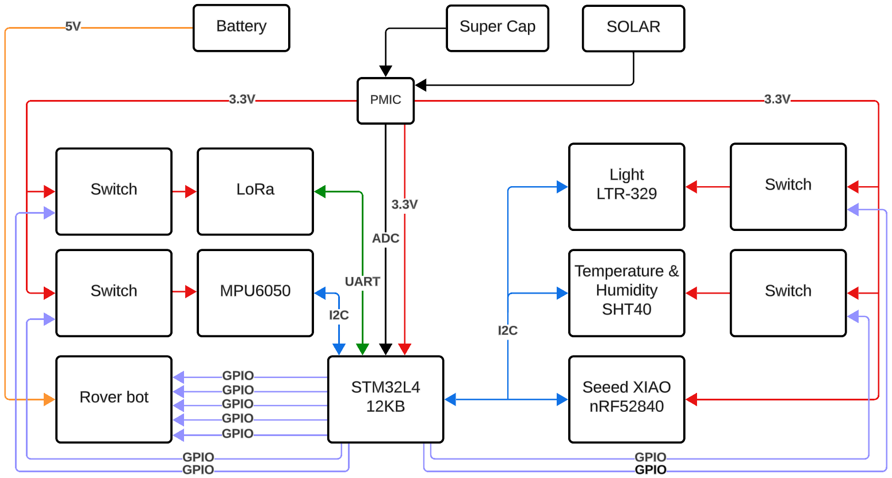

# SSR
By Adam Hejduk, Robbe Elsermans, and Thomas Kramp
## Intro
As humanities interest in Mars grows, an understanding of its weather is needed. One of the greatest challenges that the planet provides are the frequent dust storms.
This project will try to monitor the weather phenomenon (such as temperature, humidity, light, ...) to predict such storms.

> This documentation is written in [Obsidian](https://obsidian.md/).
## Project goal
Each system operates autonomously as its own master, navigating the surface of Mars independently. When a node becomes lost or encounters an issue, and another node approaches, they can exchange valuable information to assist each other. Otherwise, each node functions independently.

BLE technology is used to detect proximity between nodes and share crucial information about their headings, preventing collisions. Additionally, if a node encounters a mechanical problem and becomes immobile, it can still transmit its data to nearby nodes and gateways for continued operation and coordination.
## Project division
#### Adam
- Environmental Sensing​
- Energy harvesting ​
- Energy output management​
- Soldering man
#### Thomas
- LoRa connectivity
- Dashboard
- Gyroscope
- Rover actuation
#### Robbe
- Project management
- BLE intercommunication
- Power Profiling
- Energy Awareness
## Board selection
[Brain Board Selection page](Pages/Investigation/Brain_Board_Selection.md)

## MVP
The MVP (Minimal Vital Product) contains the following items:
- LoRa-module that transmits data to a gateway.
- Dashboard to review received data from LoRa-module.
- The ability to measure temperature and humidity.
- Energy awareness
- Use environmental source as energy source

## Power Profiling
[Power Profiling page](Power_Profiling.md)
## STM32 Module
[STM32 module page](Pages/Brain_Module/STM32L412KB.md)
## BLE Module
[BLE Module page](Pages/BLE_Module/nRF52_SEEED_XIAO.md)
## SHT40 (temperature and humidity)
[SHT40 page](Pages/Sensor/SHT40.md)
- addressing an array x addressing a place in an array 
- UART printing is not the same as printf sprintf...
- HAL libary learining
- working with datasheets of more complex nature for the first time 
- programing in more dvanced C
## LTR-329 (light)
[LTR-329 page](Pages/Sensor/LTR-329.md)
## MPU6050 (gyroscope)
[MPU6050 page](Pages/Sensor/MPU6050.md)
## Energy Harvesting
[Energy Harvesting page](Pages/Energy_Harvesting/Energy_Harvesting.md)
## Energy Awareness
[Energy Awareness page](Pages/Energy_Awareness/Energy_Awareness.md)
## LoRaModule
[LoRA Module page](z_LoRa_Module.md)
## Rover Bot
[Rover Bot page](Pages/LineBot/Rover_Bot.md)

