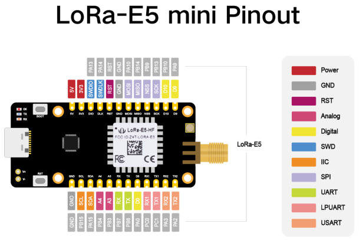
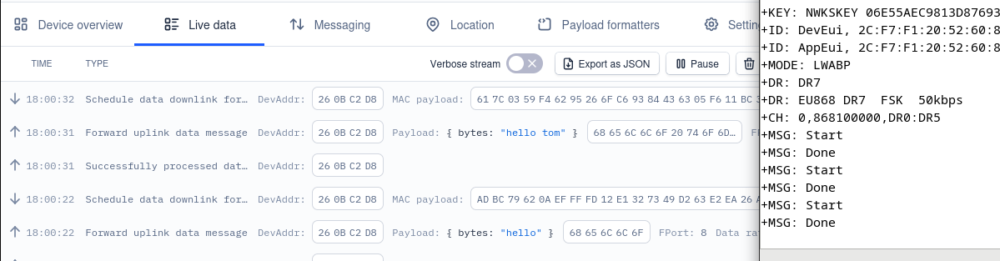

# Table of contents
==To Be Generated At the end==

# SSR
By Adam Hejduk, Robbe Elsermans, and Thomas Kramp
## Intro
As humanities interest in Mars grows, an understanding of its weather is needed. One of the greatest challenges that the planet provides are the frequent dust storms.
This project will try to monitor the weather phenomenon (such as temperature, humidity, light, ...) to predict such storms.
## Project goal
Each system operates autonomously as its own master, navigating the surface of Mars independently. When a node becomes lost or encounters an issue, and another node approaches, they can exchange valuable information to assist each other. Otherwise, each node functions independently.

BLE technology is used to detect proximity between nodes and share crucial information about their headings, preventing collisions. Additionally, if a node encounters a mechanical problem and becomes immobile, it can still transmit its data to nearby nodes and gateways for continued operation and coordination.
## Project division
#### Adam
- Environmental sensing
- Energy harvesting
#### Thomas
- LoRa connectivity
- Dashboard
- Gyroscope
- Rover actuation
#### Robbe
- Project management
- BLE communication
- Power Profiling
- Energy awareness algorithm
## Board selection
[Brain Board Selection](Pages/Investigation/Brain_Board_Selection.md)
## MVP
The MVP (Minimal Vital Product) contains the following items:
- LoRa-module that transmits data to a gateway.
- Dashboard to review received data from LoRa-module.
- The ability to measure temperature and humidity.
- Energy awareness
- Use environmental source as energy source
## Power Profiling
[Power Profiling](Pages/Power_Profiling/Power_Profiling.md)
## STM32 Module
[STM32 module](Pages/Brain_module/STM32L412KB.md)
## BLE Module
[BLE Module](Pages/BLE_Module/nRF52_SEEED_XIAO.md)
## SHT40 (temperature and humidity)
[SHT40](Pages/Sensor/SHT40.md)
- addressing an array x addressing a place in an array 
- UART printing is not the same as printf sprintf...
- HAL libary learining
- working with datasheets of more complex nature for the first time 
- programing in more dvanced C

## LTR-329 (light)
[LTR-329](Pages/Sensor/LTR-329.md)

Sleepmode: 
### . **How It Works**

1. **Active State**:
    
    - The sensor reads ambient light data and transmits it via UART.
    - The LED (`LD3_Pin`) is turned on to indicate the active state.
2. **Sleep State**:
    
    - The `LTR329_Sleep` function puts the sensor into standby mode.
    - The LED is turned off to indicate the sleep state.
    - The system waits for 5 seconds (or your preferred duration).
3. **Wake-Up State**:
    
    - The `LTR329_WakeUp` function sets the sensor back to active mode.
    - A delay is added after wake-up to allow the sensor to stabilize before the next reading.
![[StarupSequance.png]] 
according to datasheet: 
standby current: 5 $micro$A
initial startup: 100 ms
waking up: 10 ms 

![[StandbyModeLTR329.png]]
For reasons unknown Standby mode draws 96 microAmpers insted od promised 5microAmpers
Maesuring peak: 300microAmpers
SemiPeak : 157microAmpers

## Energy Harvesting
[Energy Harvesting page](../Pages/Energy_Harvesting/Energy_Harvesting.md)

## UART Communication with LoRa-Module
For the LoRa-Module, we utilize the Wio-e5 mini board.

*[Wio-e5 mini pinout](https://wiki.seeedstudio.com/LoRa_E5_mini/)*

For our communication to work we need to perform three tasks:
- Install a serial console for [UART communications](SSR_Portfolio/Pages/LoRa/UART%20Communications).
- Set up [TheThingsNetwork](SSR_Portfolio/Pages/LoRa/TheThingsNetwork).
- Create a [back-end](SSR_Portfolio/Pages/LoRa/Back-End) that collects the data and visualizes it.

If we follow these pages we should get a connection as follows:

*Some handy videos include: [setup device](https://www.youtube.com/watch?v=L_acKpwNvnc&list=WL&index=11&t=600s) & [setup MQTT](https://www.youtube.com/watch?v=9H6GFXatOCY&list=WL&index=12&t=128s)*

[Wio-E5 Datasheet](Datasheets/Wio-E5_Datasheet.pdf)

==Tom==

## I2C Communication with Rover Bot
==Tom==

